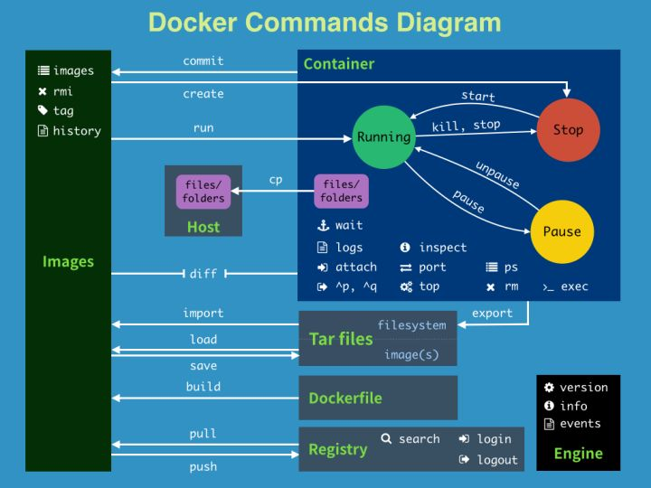
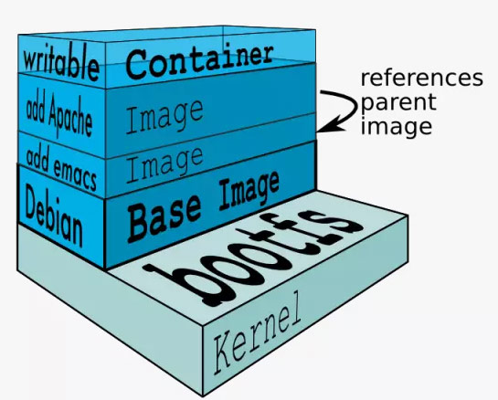
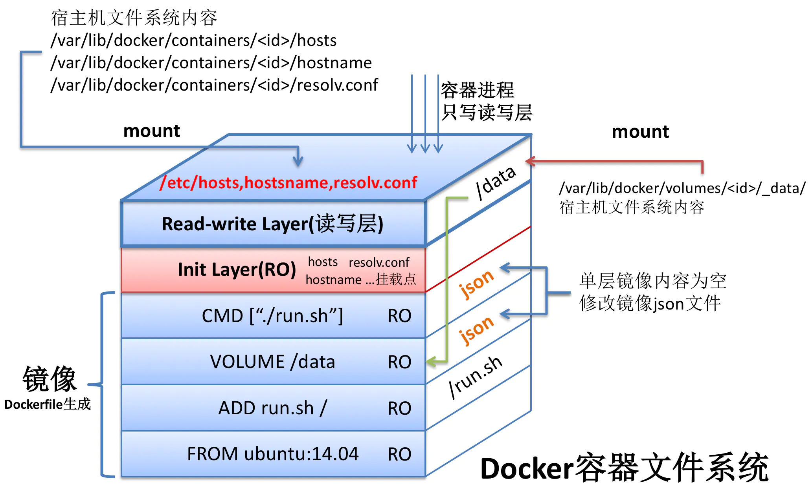
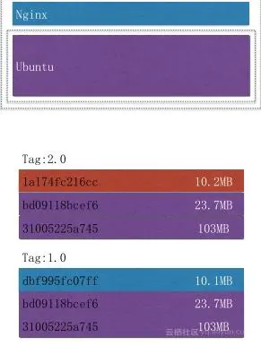

# Docker 镜像详解

## 1. 前言

在构建 Docker 容器时，应该尽量想办法获得体积更小的镜像。这是无论是去传输还是部署时，速度会更快！

**下面是差不多包含了 Docker 所有命令的一张图**

> 从中可以看出，Docker 包含三个基本概念，分别是镜像（Image）、容器（Container）和仓库（Repository）。



## 2. 概念

> 镜像是 Docker 运行容器的前提，仓库是存放镜像的场所，可见镜像更是 Docker 的核心。

- Docker 镜像可以看作是一个特殊的文件系统，除了提供容器运行时所需的程序、库、资源、配置等文件外，还包含了一些为运行时准备的一些配置参数（如匿名卷、环境变量、用户等）。

- 镜像不包含任何动态数据，其内容在构建之后也不会被改变。

**要想更深入的了解 Docker 镜像，最重要的概念就是镜像层(Layers)。**

### 2.1. 联合文件系统（Union Filesystem）

这就不得不说到**Docker 联合文件系统**(Union Filesystem)。`DockerHub`中绝大多数的镜像都是通过在 base 镜像中安装和配置需要的软件构建出来的。新镜像是从 base 镜像一层一层叠加生成的，每安装一个软件就等于在现有的镜像上增加一层。

> Docker 镜像采用分层结构的**好处就是共享资源。**



> 每一个镜像都可能依赖于由一个或多个下层的组成的另一个镜像。下层那个镜像是上层镜像的父镜像。

比如，我们从`DockerHub`拉取一个镜像


> 下载过程中，会输出获取镜像的每一层信息。

- 当容器启动时，一个新的可写层被加载到镜像的顶部，这一层就叫**容器层**，容器层之下都叫**镜像层**。
- 只有容器层是可写的，容器层下面的所有镜像层都是只读的。**对容器的任何改动都只会发生在容器层中**。

### 2.2. copy-on-write 特性

- 添加文件：在容器中创建文件时，新文件被添加到容器层中。
- 读取文件：当在容器中读取某个文件时，Docker 会从上往下依次在各镜像层中查找此文件，一旦找到打开并读入内存。
- 修改文件：在容器中修改已存在的文件时，Docker 会从上往下依次在各个镜像层中查找此文件，一旦找到立即将其复制到容器层中，然后才修改。
- 删除文件：在容器中删除文件时，Docker 会从上往下依次在镜像层中找，找到后，会在容器层记录下此删除操作。

> `copy-on-write` 特性说明容器层保存的是镜像变化的部分，不会对镜像本身进行任何修改。所以镜像可以被多个容器共享。

### 2.3. 镜像与容器的关系

可以通过下图来理解 docker daemon、docker 镜像以及 docker 容器三者的关系。


- 当由 ubuntu:14.04 镜像启动容器时，ubuntu:14.04 镜像的镜像层内容将作为容器的 rootfs。

- ubuntu:14.04 镜像的 json 文件，会由 docker daemon 解析，并提取出其中的容器执行入口 CMD 信息，以及容器进程的环境变量 ENV 信息，最终初始化容器进程。

## 3. Docker 镜像制作

?>制作 Docker 镜像有两种方式，一种是使用`docker commit`命令制作，一种是使用`Dockerfile`文件构建。这里就不具体介绍了。

**对应 Docker 镜像，都要保证镜像尽可能小**，可以从如下方面去优化。

- 基础镜像小
- 层级尽量少
- 去除不必要
- 复用镜像层
- 分阶段构建

### 3.1. 层级尽量少

如使用 Dockerfile 构建镜像，以下面这个文件为例。

```dockerfile
FROM ubuntu:14.04
ADD run.sh /
VOLUME /data
CMD ["./run.sh"]
```

**联合文件系统对应的层次结构如下图所示**



**在 docker1.10 后只有 RUN、COPY、ADD 指令会创建层**，其他指令会创建临时的中间镜像，不会直接增加构建的镜像大小。在编写 Dockerfile 时，我们需要根据实际情况去合并一些指令，因为**copy-on-write 特性**，上面层的文件，如果和下面层有冲突或不同，它会复制下层文件，然后再修改。

### 3.2. 去除不必要

我们在使用`Dockerfile`构建过程中或手动构建后`commit`的过程中所产生的临时文件，比如源码包、编译过程中产生的日志文件、添加的包管理仓库、包管理缓存，以及构建过程中安装的一些当时又用过后没用的软件或工具。还有一些不需要容器运行时构建的文件，这些文件不应该打包到镜像里面，而应该通过容器卷的方式在运行时候去挂载。

### 3.3. 复用镜像层

- 比如要基于一个 Ubuntu 镜像去构建 Nginx 镜像，我们只需要在 Ubuntu 镜像的基础上面做一些 Nginx 的安装配置工作，一个 Nginx 镜像工作就算制作完成了。
- 优化镜像存储空间，假如我们有两个镜像，Tag1.0 镜像和 Tag2.0 镜像，我们如果以传统方式去传这两个镜像，每个镜像大概 130 多兆，但如果我们以分层的方式去存储两个镜像，我们通过下面两个紫色的才能共享，可以节约大量的空间，两个镜像加起来只需要 140 多兆的空间就可以存下来。这样一是节省了存储空间，二是可以减少网络上的开销，比如我们已经把下面镜像下载了，我们要去下载上面镜像的时候，我们只需要去下 10M 的部分。



### 3.4. 分阶段构建

通过将构建过程分析，分成多个阶段来执行，后面的或者最终的构建可以使用前面构建的结果，而不需要所有的构建都包含到最终的镜像中。拿 nginx 构建来举个例子

> Docker v17.05 开始支持多阶段构建 (`multistage builds`)。

**常规构建方式**

创建用于`Dockerfile`构建的目录

```shell
mkdir build && cd build/
```

准备如下文件


[nginx-1.15.8.tar.gz](http://nginx.org/download/nginx-1.15.8.tar.gz)

```dockerfile
FROM centos:7
COPY yum.repo /etc/yum.repos.d
ADD nginx-1.15.8.tar.gz /mnt
WORKDIR /mnt/nginx-1.15.8
RUN rpmdb --rebuilddb && yum install -y gcc pcre-devel zlib-devel make && yum clean all
RUN sed -i 's/CFLAGS="$CFLAGS -g"/#CFLAGS="$CFLAGS -g"/g' auto/cc/gcc
RUN ./configure --prefix=/usr/local/nginx &> /dev/null
RUN make &> /dev/null
RUN make install &> /dev/null
EXPOSE 80
VOLUME ["/usr/local/nginx/html"]
CMD ["/usr/local/nginx/sbin/nginx", "-g", "daemon off;"]
```

构建镜像

```
docker build -t nginx:v1 .
```


> 可以发现足足多了 103MB

**分阶段构建方式**

```dockerfile
FROM centos:7 as build
COPY yum.repo /etc/yum.repos.d
ADD nginx-1.15.8.tar.gz /mnt
WORKDIR /mnt/nginx-1.15.8
RUN rpmdb --rebuilddb && yum install -y gcc pcre-devel zlib-devel make && yum clean all && sed -i 's/CFLAGS="$CFLAGS -g"/#CFLAGS="$CFLAGS -g"/g' auto/cc/gcc && ./configure --prefix=/usr/local/nginx &> /dev/null && make &> /dev/null && make install &> /dev/null && rm -fr /mnt/nginx-*

FROM  centos:7
COPY --from=build /usr/local/nginx /usr/local/nginx
EXPOSE 80
VOLUME ["/usr/local/nginx/html"]
CMD ["/usr/local/nginx/sbin/nginx", "-g", "daemon off;"]
```

```shell
docker build -t nginx:v2 .
```


> 惊人发现居然只比基础镜像多了 1MB！

---
