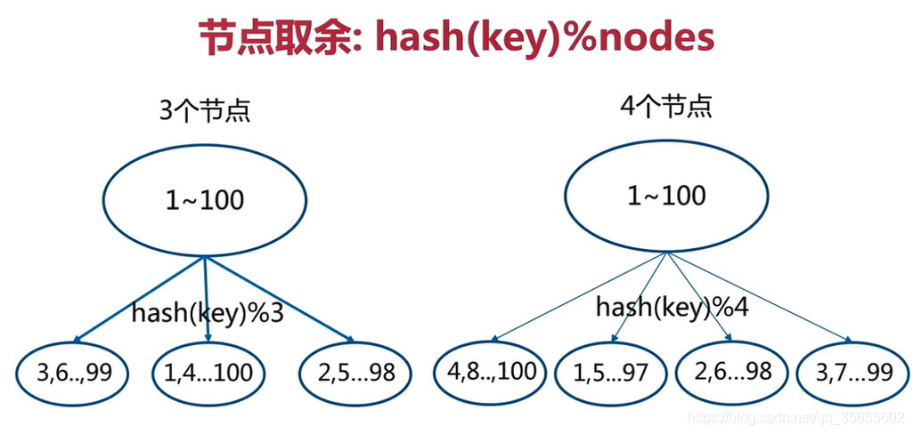

# 容器问题

## 分布式缓存问题

比如有 1 ～ 2 亿的数据需要缓存，如何设计存储方案？

单机单台 100%不可能,肯定是分布式存储，如何用 Redis 落地？

### 哈希取余分区

比如我们有三台 Redis 的主服务器，我们要存储用户 id 为 10 的数据。这时我们的公式为：hash(10) % 3 = 1(hash(10) = 10)，我们就可以定位到将用户用户 id 为 10 的数据存入到 master1 的服务器节点中。当我们获取数据时一样通过公式能定位到 master1 主节点，这们就省去了遍历所有服务器的时间，从而大大提升了性能。

**缺点分析**

节点取余分区方式有一个问题：即当增加或减少节点时，原来节点中的 80% 的数据会进行迁移操作，对所有数据重新进行分布

### 一致性哈希算法分区

## 参考资料

- [【Redis】哈希分布的三种方式](https://blog.csdn.net/qq_35655602/article/details/116034418)
