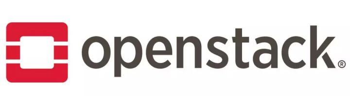
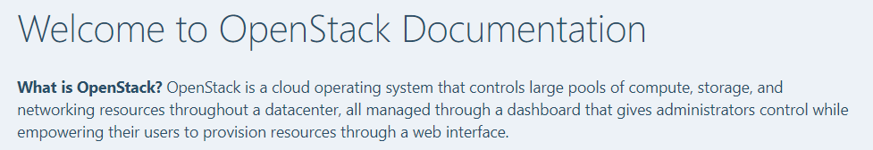
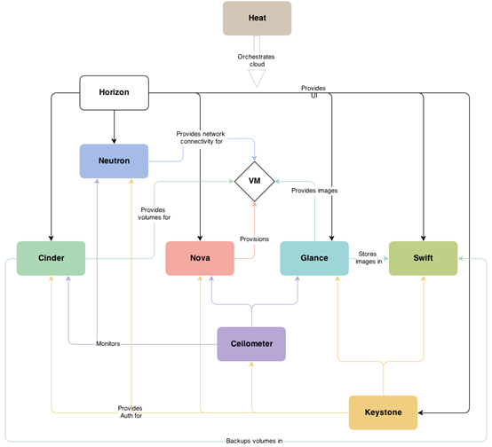
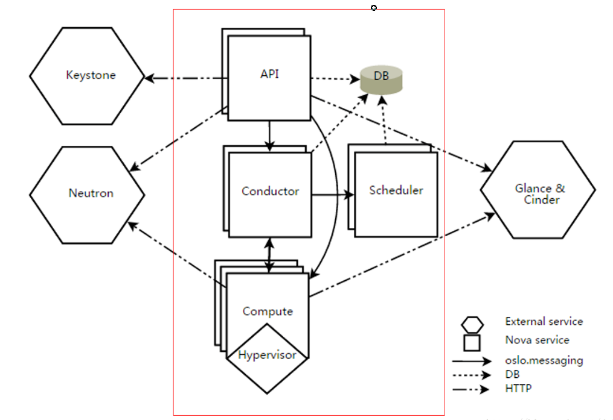
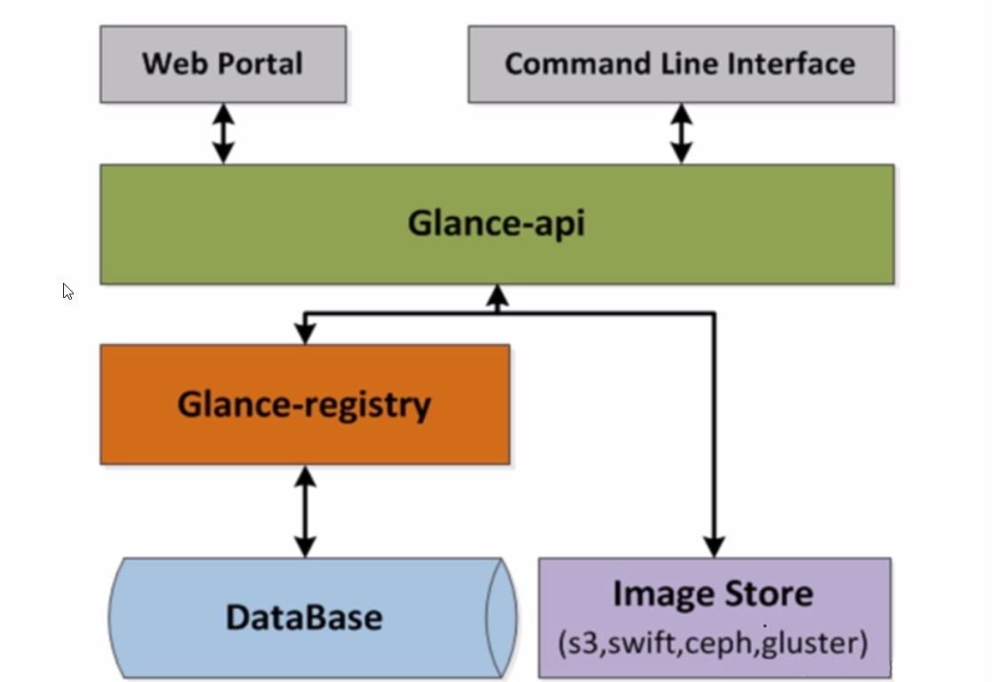

# OpenStack

## OpenStack简介



### 1、什么是云计算？

`云计算`是一种`按使用量付费`的模式，这种模式提供可用的、便捷的、按需的网络访问，进入可配置的计算资源共享池（资源包括网络，服务器，存储，应用软件，服务），这些资源能够被快速提供，只需投入很少的管理工作，或与服务供应商进行很少的交互。

>   了解OpenStack之前，可能很多朋友还不了解什么是云计算，这篇文章是我刚上大学时候，了解云计算是什么时候发现的，十分通俗易懂。
>
>   [终于有人把云计算、大数据和 AI 讲明白了](https://blog.csdn.net/p5deyt322jacs/article/details/80745723)

### 2、什么是OpenStack呢？

先来到他的[官方文档](https://docs.openstack.org/ussuri/?_ga=2.175168098.1799264143.1599786551-970692831.1574130478)，看看官方的解释。

**What is OpenStack?** OpenStack is a cloud operating system that controls large pools of compute, storage, and networking resources throughout a datacenter, all managed through a dashboard that gives administrators control while empowering their users to provision resources through a web interface.



大概意思就是：

-   OpenStack是一个云操作系统，控制整个数据中心的大型计算、存储和网络资源池。
-   所有这些都是通过仪表板（`dashboard `）进行管理的，仪表板为管理员提供控制，同时使用户能够通过web界面提供资源。

### 3、OpenStack的架构

>   九大组件




| 服务名称                             |  项目名称  |                     描述                     |
| ------------------------------------ | :--------: | :------------------------------------------: |
| Dasgviard                            |  Horizon   | 基于Openstack API接口使用diango开发的Web管理 |
| Compute                              |    Nova    |         通过虚拟化技术提供计算资源池         |
| Networking                           |  Neutron   |         实现了虚拟机的网络资源管理。         |
|                                      |            |                                              |
| **Storage (存储)**                   |            |                                              |
| Object Storage                       |   Swift    |     对象存储，适用于“一次写入、多次读取”     |
| Block Storage                        |   Cinder   |            块存储，提供存储资源池            |
|                                      |            |                                              |
| **Shared Services （共享服务）**     |            |                                              |
| Identify Service                     |  Keystone  |                   认证管理                   |
| Image Service                        |   Glance   |         提供虚拟镜像的注册和存储管理         |
| Telemetry                            | Ceilometer |         提供监控和数据采集、计量服务         |
|                                      |            |                                              |
| **Higher-level Services (高层服务)** |            |                                              |
| Orchestration                        |    Heat    |               自动化部署的组件               |
| Database Service                     |   Trove    |              提供数据库应用服务              |

### 4、九大模块介绍

#### Nova

`Nova`（`OpenStack Compute Service`）是 `OpenStack `最核心的服务，负责维护和管理云环境的计算资源，同时管理虚拟机生命周期。

>   `Nova `逻辑架构如下图所示（红色方框内为 `Nova `组件，方框外为 `Nova `和 `OpenStack` 其他服务之间的调用关系）



| 模块             | 功能                                                         | 一般储存位置 |
| ---------------- | ------------------------------------------------------------ | ------------ |
| nova-aqi         | 接受rest消息，响应客户的 API 调用。                          | 控制节点     |
| nova-scheduler   | 虚机调度服务，选择适合的主机                                 | 控制节点     |
| nova-conductor   | 数据库操作和复杂流程控制                                     | 控制节点     |
| nova-compute     | 管理虚机的核心服务，通过调用 Hypervisor API管理生命周期管理和资源管理 | 计算节点     |
| nova-cert        | 负责身份认证                                                 | 计算节点     |
| nova-novncproxy  | novnc访问虚拟机代理                                          | 控制节点     |
| nova-consoleauth | 用户控制台的授权验证                                         | 控制节点     |


#### Keystone

Keystone为所有的`OpenStack`组件提供认证和访问策略服务，它依赖自身REST（基于Identity API）系统进行工作，主要对（但不限于）Swift、Glance、Nova等进行认证与授权。事实上，授权通过对动作消息来源者请求的合法性进行鉴定。

#### Glance

`OpenStack`镜像服务器是一套虚拟机镜像发现、注册、检索系统，我们可以将镜像存储到以下任意一种存储中：

-   本地文件系统（默认）
-   S3直接存储
-   S3对象存储（作为S3访问的中间渠道）
-   OpenStack对象存储等等。



#### Swift

`Swift`是`OpenStack`提供一种分布式，持续虚拟对象存储，它类似于`Amazon Web Service`的`S3`简单存储服务。`Swift`具有跨节点百级对象存储的能力。`Swift`内建冗余和失效备源管理，也能够处理归档和媒体流，特别是对大数据（千兆字节）和大容量（多对象数量）的测度非常高效。

>   无需采用`RAID`（磁盘冗余阵列），也没有中心单元或主控结点。`Swift`通过在软件层面引入一致性哈希技术和数据冗余性，牺牲一定程度的数据一致性来达到高可用性（`High Availability`，简称`HA`）和可伸缩性，支持多租户模式、容器和对象读写操作，适合解决互联网的应用场景下**非结构化数据存储问题**。

特点：

- 极高的数据持久性（Durability）

- 完全对称的系统架构

  ```markdown
  - 对称”意味着Swift中各节点可以完全对等，能极大地降低系统维护成本"
  ```

- 无单点故障

  ```markdown
  - Swift的元数据存储是完全均匀随机分布的，并且与对象文件存储一样，元数据也会存储多份。整个Swift集群中，也没有一个角色是单点的，并且在架构和设计上保证无单点业务是有效的。
  ```

- 无限的可扩展性

  ```markdown
  - 一是数据存储容量无限可扩展；二是Swift性能（如QPS、吞吐量等）可线性提升。
  ```

#### Cinder

`Cinder `是`OpenStack Block Storage`服务，主要是为虚拟机实例提供`volume`（虚拟磁盘）。核心是对卷的管理，允许对卷、卷的类型、卷的快照进行处理。它并没有实现对块设备的管理和实际服务，而是为后端不同的存储结构提供了统一的接口，不同的块设备服务厂商在`Cinder`中实现其驱动支持以与`OpenStack`进行整合。

>   一个`volume`卷可以同时挂载到多个实例上，但是同时只能有一个实例可以对卷进行写操作，其他只能是只读的。


#### Neutron

`Neutron`是`OpenStack`核心项目之一，提供云计算环境下的虚拟网络功能。`OpenStack`网络（`Neutron`）管理`OpenStack`环境中所有虚拟网络基础设施（`VNI`），物理网络基础设施（`PNI`）的接入层。

>   `Neutron `是一个用`python`写的分布式软件项目，用来实现`OpenStack`中的网络服务。

#### Heat

 `Heat`是`OpenStack`提供的自动编排功能的组件，基于描述性的模板，来编排复合云应用程序。

```markdown
- 编排服务通过运行调用生成运行中云应用程序的OpenStack API为描述云应用程序提供基于模板的编排。该软件将其他OpenStack核心组件整合进一个单文件模板系统。模板允许你创建很多种类的OpenStack资源，如实例，浮点IP，云硬盘，安全组和用户。它也提供高级功能，如实例高可用，实例自动缩放，和嵌套栈。这使得OpenStack的核心项目有着庞大的用户群。
```


#### Ceilometer

`Ceilometer`成为`OpenStack`里数据采集（监控数据、计费数据）的唯一基础设施，采集到的数据提供给监控、计费、面板等项目使用。

-   OpenStack中的数据监控器。
-   为流量计费提供数据支持。


