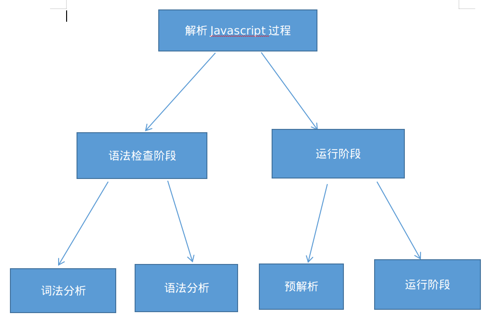
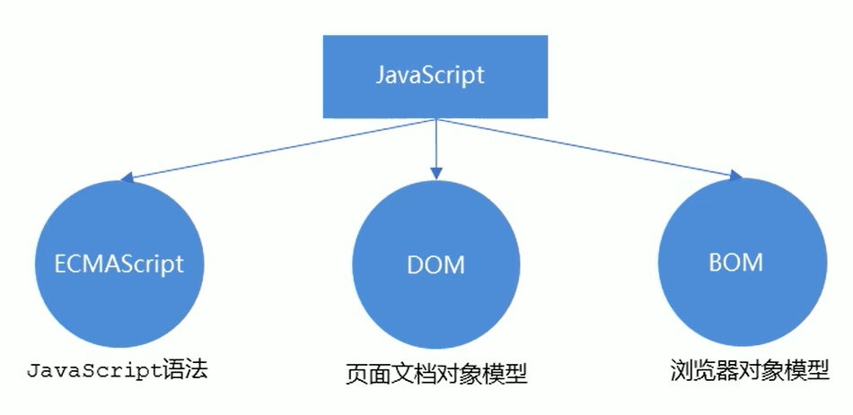

# JavaScript 初识

## 1. JavaScript 是什么

- JavaScript 是世界上最流行的语言之一，是-种运行在客户端的脚本语言( Script 是脚本的意思)
- 脚本语言: 不需要编译,运行过程中由 js 解释器(js 引擎)逐行来进行解释并执行
- 现在也可以基于 Node.js 技术进行服务器端编程

## 2. Javascript 执行过程

浏览器分成两部分：**渲染引擎**和**JS 引擎**

::: tip
浏览器本身并不会执行 JS 代码，而是通过内置 JavaScript 引擎(解释器)来执行 JS 代码。JS 引擎执行代码时逐行解释
每一句源码(转换为机器语言) ，然后由计算机去执行
:::



## 3. Javascript 组成



## 4. Javascript 书写位置

### 4.1. 行内式 js（很少使用）

```html{8}
<!DOCTYPE html>
<html lang="en">
  <head>
    <meta charset="UTF-8" />
    <title>Javascript书写位置</title>
  </head>
  <body>
    <input type="button" value="按钮" onclick="alert('行内弹窗')" />
  </body>
</html>
```

### 4.2. 内嵌式 js（常用）

```html{6-8}
<!DOCTYPE html>
<html lang="en">
  <head>
    <meta charset="UTF-8" />
    <title>Javascript书写位置</title>
    <script>
      alert("内嵌式弹窗");
    </script>
  </head>
  <body></body>
</html>
```

### 4.3. 外部 js 文件

_利于代码结构化 便于文件复用_

```html{6}
<!DOCTYPE html>
<html lang="en">
  <head>
    <meta charset="UTF-8" />
    <title>Javascript书写位置</title>
    <script src="my.js"></script>
  </head>
  <body></body>
</html>
```
