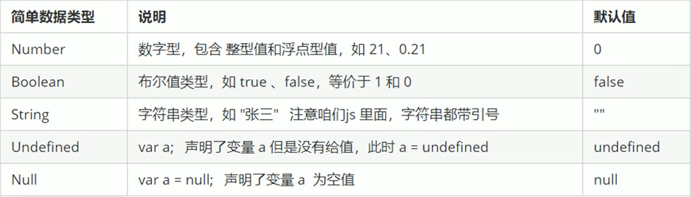

# JavaScript 数据类型

## 1. 引言

::: tip
JavaScript 是一种弱类型或者说动态语言。这意味着你不用提前声明变量的类型，在程序运行过程中，类型会被自动确定。这也意味着你可以使用同一个变量保存不同类型的数据：
:::

JS 把数据类型分为两类：

- 简单数据类型

  ::: details

  

  :::

- 复杂数据库类型（object）

## 2. 简单数据类型

### 2.1. 数字型 Number

```html
<script>
  var num = 10; // num 数字型
  var PI = 3.14; // PI 数字型
  // 1. 八进制  0 ~ 7  我们程序里面数字前面加0 表示八进制
  var num1 = 010;
  console.log(num1); //  010  八进制 转换为 10进制 就是  8
  var num2 = 012;
  console.log(num2); // 10
  // 2. 十六进制  0 ~ 9  a ~ f    #ffffff  数字的前面加 0x 表示十六进制
  var num3 = 0x9;
  console.log(num3); // 9
  var num4 = 0xa;
  console.log(num4); //10
  // 3. 数字型的最大值
  console.log(Number.MAX_VALUE); // 1.7976931348623157e+308
  // 4. 数字型的最小值
  console.log(Number.MIN_VALUE); // 5e-324
  // 5. 无穷大
  console.log(Number.MAX_VALUE * 2); // Infinity 无穷大
  // 6. 无穷小
  console.log(-Number.MAX_VALUE * 2); // -Infinity 无穷大
  // 7. 非数字
  console.log("bzm" - 100); // NaN
</script>
```

### 2.2. 字符串型 String

在字符串中可以使用转义字符转义的特殊字符：

| 代码 | 输出        |
| :--- | :---------- |
| \'   | 单引号      |
| \"   | 双引号      |
| \\   | 反斜杠      |
| \n   | 换行        |
| \r   | 回车        |
| \t   | tab(制表符) |
| \b   | 退格符      |
| \f   | 换页符      |

```html{6-12}
<!DOCTYPE html>
<html lang="en">
  <head>
    <meta charset="UTF-8" />
    <title>字符串型String</title>
    <script>
      var str = "我爱学习";
      console.log(str);
      // 字符串转义字符  都是用 \ 开头
      var str1 = "我是一个'爱学习'的\n程序员";
      console.log(str1);
    </script>
  </head>
  <body></body>
</html>
```

多个字符串之间可以使用+进行拼接,其拼接方式为字符串+任何类型=拼接之后的新字符串

```html{6-9}
<!DOCTYPE html>
<html lang="en">
  <head>
    <meta charset="UTF-8" />
    <title>字符串型String</title>
    <script>
      console.log("Bzm" + "爱学习!"); // Bzm爱学习!
      console.log(666 + "Bzm" + "爱学习!" + 666); // 666Bzm爱学习!666
    </script>
  </head>
  <body></body>
</html>
```

:::tip

数值相加，字符相连

:::

### 2.3. 布尔型 Boolean

布尔类型有两个值：true 和 false

```html{6-10}
<!DOCTYPE html>
<html lang="en">
  <head>
    <meta charset="UTF-8" />
    <title>布尔型Boolean</title>
    <script>
      var flag = true;
      console.log(flag); // true
      console.log(flag + 1); // 2
    </script>
  </head>
  <body></body>
</html>
```

:::tip

true 参与加法运算当为 1，false 当着 0

:::

## 3. 获取变量数据类型

typeof 可用来获取检测变量的数据类型

```html{6-21}
<!DOCTYPE html>
<html lang="en">
  <head>
    <meta charset="UTF-8" />
    <title>获取变量数据类型</title>
    <script>
      var num = 10;
      console.log(typeof num); // number
      var name = "bzm";
      console.log(typeof name); // string
      var flag = true;
      console.log(typeof flag); // boolean
      var vari = undefined;
      console.log(typeof vari); // undefined
      var timer = null;
      console.log(typeof timer); // object
      // prompt 取过来的值是 字符型的
      var age = prompt("请输入您的年龄");
      console.log(age);
      console.log(typeof age); // string
    </script>
  </head>
  <body></body>
</html>
```

## 4. 数据类型转换

### 4.1. 为什么需要进行类型转换

使用表单、prompt 获取过来的数据默认是字符串类型的,此时就不能直接简单的进行加法运算

### 4.2. 转换为字符型

```html{6-16}
<!DOCTYPE html>
<html lang="en">
  <head>
    <meta charset="UTF-8" />
    <title>转换为字符型</title>
    <script>
      // 1. 把数字型转换为字符串型 变量.toString()
      var num = 10;
      var str = num.toString();
      console.log(str);
      console.log(typeof str); // string
      // 2. 我们利用 String(变量)
      console.log(String(num));
      // 3. 利用 + 拼接字符串的方法实现转换效果 隐式转换
      console.log(num + "");
    </script>
  </head>
  <body></body>
</html>
```

### 4.3. 转换为数字型

```html{6-24}
<!DOCTYPE html>
<html lang="en">
  <head>
    <meta charset="UTF-8" />
    <title>转换为数字型</title>
    <script>
      // 1. parseInt(变量)  可以把 字符型的转换为数字型 得到是整数
      console.log(parseInt("3.14")); // 3 取整
      console.log(parseInt("3.94")); // 3 取整
      console.log(parseInt("120px")); // 120 会去到这个px单位
      console.log(parseInt("rem120px")); // NaN
      // 2. parseFloat(变量) 可以把 字符型的转换为数字型 得到是小数 浮点数
      console.log(parseFloat("3.14")); // 3.14
      console.log(parseFloat("120px")); // 120 会去掉这个px单位
      console.log(parseFloat("rem120px")); // NaN
      // 3. 利用 Number(变量)
      var str = "123";
      console.log(Number(str));
      console.log(Number("12"));
      // 4. 利用了算数运算 -  *  /  隐式转换
      console.log("12" - 0); // 12
      console.log("123" - "120"); // 3
      console.log("123" * 1); // 123
    </script>
  </head>
  <body></body>
</html>
```

### 4.4. 转换为布尔型

```html{6-16}
<!DOCTYPE html>
<html lang="en">
  <head>
    <meta charset="UTF-8" />
    <title>转换为布尔型</title>
    <script>
      console.log(Boolean("")); // false
      console.log(Boolean(0)); // false
      console.log(Boolean(NaN)); // false
      console.log(Boolean(null)); // false
      console.log(Boolean(undefined)); // false
      console.log("------------------------------");
      console.log(Boolean("123")); // true
      console.log(Boolean("你好吗")); // true
    </script>
  </head>
  <body></body>
</html>
```
