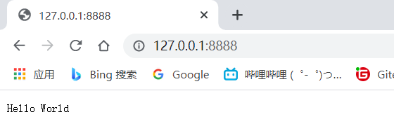

# NodeJS第一个应用

```js
var http = require('http');

http.createServer(function (request, response) {

    // 发送 HTTP 头部 
    // HTTP 状态值: 200 : OK
    // 内容类型: text/plain
    response.writeHead(200, {'Content-Type': 'text/plain'});

    // 发送响应数据 "Hello World"
    response.end('Hello World\n');
}).listen(8888);

// 终端打印如下信息
console.log('Server running at http://127.0.0.1:8888/');
```

以上代码我们完成了一个可以工作的 HTTP 服务器。

使用 **node** 命令执行以上的代码：

```shell
node server.js
```


然后在浏览器访问http://127.0.0.1:8888/

