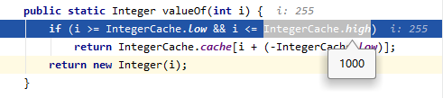

# Java 基础

## 引言

来自互联网，主要来自以下几位大佬。

### [程序员囧辉](https://blog.csdn.net/v123411739)

- [Java 基础高频面试题（2021 年最新版）](https://blog.csdn.net/v123411739/article/details/115364158?spm=1001.2014.3001.5502)

## 正文

[[toc]]

### 1. 下面两个代码块能正常编译和执行吗？

```java
// 代码块1
short s1 = 1; s1 = s1 + 1;
// 代码块2
short s1 = 1; s1 += 1;
```

::: details 解析

> 代码块 1 编译报错，错误原因是：不兼容的类型: 从 int 转换到 short 可能会有损失”。
>
> 代码块 2 正常编译和执行。

我们将代码块 2 进行编译，字节码如下：

```java
public class com.joonwhee.open.demo.Convert {
  public com.joonwhee.open.demo.Convert();
    Code:
       0: aload_0
       1: invokespecial #1 // Method java/lang/Object."<init>":()V
       4: return

  public static void main(java.lang.String[]);
    Code:
       0: iconst_1 // 将int类型值1入（操作数）栈
       1: istore_1 // 将栈顶int类型值保存到局部变量1中
       2: iload_1 // 从局部变量1中装载int类型值入栈
       3: iconst_1 // 将int类型值1入栈
       4: iadd // 将栈顶两int类型数相加，结果入栈
       5: i2s // 将栈顶int类型值截断成short类型值，后带符号扩展成int类型值入栈。
       6: istore_1 // 将栈顶int类型值保存到局部变量1中
       7: return
}
```

> 可以看到字节码中包含了 i2s 指令，该指令用于将 int 转成 short。i2s 是 int to short 的缩写。
>
> 其实，s1 += 1 相当于 s1 = (short)(s1 + 1)，有兴趣的可以自己编译下这两行代码的字节码，你会发现是一摸一样的。

:::

### 2. 自动装箱，指出下题的输出结果

```java
public static void main(String[] args) {
    Integer a = 128, b = 128, c = 127, d = 127;
    System.out.println(a == b);
    System.out.println(c == d);
}
```

::: details 解析

**答案是：false，true。**

执行 Integer a = 128，相当于执行：Integer a = Integer.valueOf(128)，基本类型自动转换为包装类的过程称为自动装箱（autoboxing）。

```java
public static Integer valueOf(int i) {
    if (i >= IntegerCache.low && i <= IntegerCache.high)
        return IntegerCache.cache[i + (-IntegerCache.low)];
    return new Integer(i);
}
```

在 Integer 中引入了 IntegerCache 来缓存一定范围的值，IntegerCache 默认情况下范围为：-128~127。

本题中的 127 命中了 IntegerCache，所以 c 和 d 是相同对象，而 128 则没有命中，所以 a 和 b 是不同对象。

> 但是这个缓存范围时可以修改的，可能有些人不知道。可以通过 JVM 启动参数：-XX:AutoBoxCacheMax=`size` 来修改上限值，如下图所示：



:::

### 3. 用最有效率的方法计算 2 乘以 8？

::: details 解析

2 << 3。

> 进阶：通常情况下，可以认为位运算是性能最高的。但是，其实编译器现在已经“非常聪明了”，很多指令编译器都能自己做优化。所以在实际实用中，我们无需特意去追求实用位运算，这样不仅会导致代码可读性很差，而且某些自作聪明的优化反而会误导编译器，使得编译器无法进行更好的优化。

:::

### 4. &和&&的区别？

::: details 解析

&&：逻辑与运算符。当运算符左右两边的表达式都为 true，才返回 true。同时具有短路性，如果第一个表达式为 false，则直接返回 false。

&：逻辑与运算符、按位与运算符。

按位与运算符：用于二进制的计算，只有对应的两个二进位均为 1 时，结果位才为 1 ，否则为 0。

逻辑与运算符：& 在用于逻辑与时，和 && 的区别是不具有短路性。所在通常使用逻辑与运算符都会使用 &&，而 & 更多的适用于位运算。
:::

### 5. String 是 Java 基本数据类型吗？

::: details 解析

答：不是。Java 中的基本数据类型只有 8 个：byte、short、int、long、float、double、char、boolean；除了基本类型（primitive type），剩下的都是引用类型（reference type）。

基本数据类型：数据直接存储在栈上

引用数据类型区别：数据存储在堆上，栈上只存储引用地址
:::

### 6. String 和 StringBuilder、StringBuffer 的区别？

::: details 解析

- String：String 的值被创建后不能修改，任何对 String 的修改都会引发新的 String 对象的生成。

- StringBuffer：跟 String 类似，但是值可以被修改，使用 synchronized 来保证线程安全。

- StringBuilder：StringBuffer 的非线程安全版本，没有使用 synchronized，具有更高的性能，推荐优先使用。

:::

### 7. String s = "xyz" 和 String s = new String("xyz") 区别？

::: details 解析

两个语句都会先去字符串常量池中检查是否已经存在 “xyz”，如果有则直接使用，如果没有则会在常量池中创建 “xyz” 对象。

另外，String s = new String("xyz") 还会通过 new String() 在堆里创建一个内容与 "xyz" 相同的对象实例。

所以前者其实理解为被后者的所包含。
:::

### 8. == 和 equals 的区别是什么？

::: details 解析

==：运算符，用于比较基础类型变量和引用类型变量。

> 对于基础类型变量，比较的变量保存的值是否相同，类型不一定要相同。

```java
short s1 = 1; long l1 = 1;
// 结果：true。类型不同，但是值相同
System.out.println(s1 == l1);
```

对于引用类型变量，比较的是两个对象的地址是否相同。

```java
Integer i1 = new Integer(1);
Integer i2 = new Integer(1);
// 结果：false。通过new创建，在内存中指向两个不同的对象
System.out.println(i1 == i2);
```

equals：Object 类中定义的方法，通常用于比较两个对象的值是否相等。

> equals 在 Object 方法中其实等同于 ==，但是在实际的使用中，equals 通常被重写用于比较两个对象的值是否相同。

```java
Integer i1 = new Integer(1);
Integer i2 = new Integer(1);
// 结果：true。两个不同的对象，但是具有相同的值
System.out.println(i1.equals(i2));

// Integer的equals重写方法
public boolean equals(Object obj) {
    if (obj instanceof Integer) {
        // 比较对象中保存的值是否相同
        return value == ((Integer)obj).intValue();
    }
    return false;
}
```

:::

### 9. 两个对象的 hashCode() 相同，则 equals() 也一定为 true，对吗？

::: details 解析

不对。hashCode() 和 equals() 之间的关系如下：

当有 a.equals(b) == true 时，则 a.hashCode() == b.hashCode() 必然成立，

反过来，当 a.hashCode() == b.hashCode() 时，a.equals(b) 不一定为 true。

[两个对象的 hashCode()相同，则 equals()也一定为 true，对吗？](https://blog.csdn.net/qq_35883086/article/details/100743663#:~:text=%E7%BB%93%E8%AE%BA%EF%BC%9A%20%E4%B8%A4%E4%B8%AA%E5%AF%B9%E8%B1%A1equals,%E5%B0%86%E5%AF%B9%E8%B1%A1%E8%BF%9B%E8%A1%8Ceq...)

:::

### 10. 什么是反射

::: details 解析

反射是指在运行状态中，对于任意一个类都能够知道这个类所有的属性和方法；并且对于任意一个对象，都能够调用它的任意一个方法；这种**动态获取信息以及动态调用对象方法的功能**称为**反射机制**。

:::

### 11. 深拷贝和浅拷贝区别是什么？

::: details 解析

数据分为基本数据类型和引用数据类型。基本数据类型：数据直接存储在栈中；引用数据类型：存储在栈中的是对象的引用地址，真实的对象数据存放在堆内存里。

- 浅拷贝：对于基础数据类型：直接复制数据值；对于引用数据类型：只是复制了对象的引用地址，新旧对象指向同一个内存地址，修改其中一个对象的值，另一个对象的值随之改变。

- 深拷贝：对于基础数据类型：直接复制数据值；对于引用数据类型：开辟新的内存空间，在新的内存空间里复制一个一模一样的对象，新老对象不共享内存，修改其中一个对象的值，不会影响另一个对象。

> 深拷贝相比于浅拷贝速度较慢并且花销较大。

:::

### 12. Java 静态变量和成员变量的区别

```java
public class Demo {
    /**
     * 静态变量：又称类变量，static修饰
     */
    public static String STATIC_VARIABLE = "静态变量";
    /**
     * 实例变量：又称成员变量，没有static修饰
     */
    public String INSTANCE_VARIABLE = "实例变量";
}
```

::: details 解析

1. 成员变量存在于堆内存中。静态变量存在于方法区中。
2. 成员变量与对象共存亡，随着对象创建而存在，随着对象被回收而释放。静态变量与类共存亡，随着类的加载而存在，随着类的消失而消失。
3. 成员变量所属于对象，所以也称为实例变量。静态变量所属于类，所以也称为类变量。
4. 成员变量只能被对象所调用 。静态变量可以被对象调用，也可以被类名调用。

:::

### 13. 是否可以从一个静态（static）方法内部发出对非静态（non-static）方法的调用？

::: details 解析

区分两种情况，发出调用时是否显示创建了对象实例。

1）没有显示创建对象实例：不可以发起调用，非静态方法只能被对象所调用，静态方法可以通过对象调用，也可以通过类名调用，所以静态方法被调用时，可能还没有创建任何实例对象。因此通过静态方法内部发出对非静态方法的调用，此时可能无法知道非静态方法属于哪个对象。

```java
public class Demo {
    public static void staticMethod() {
        // 直接调用非静态方法：编译报错
        instanceMethod();
    }
    public void instanceMethod() {
        System.out.println("非静态方法");
    }
}
```

2）显示创建对象实例：可以发起调用，在静态方法中显示的创建对象实例，则可以正常的调用。

```java
public class Demo {
    public static void staticMethod() {
        // 先创建实例对象，再调用非静态方法：成功执行
        Demo demo = new Demo();
        demo.instanceMethod();
    }
    public void instanceMethod() {
        System.out.println("非静态方法");
    }
}
```

:::
