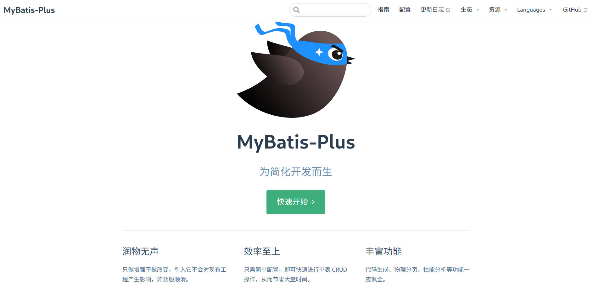

# MyBatis-Plus

# 引言

[MyBatis-Plus (opens new window)](https://github.com/baomidou/mybatis-plus)（简称 MP）是一个 [MyBatis (opens new window)](https://www.mybatis.org/mybatis-3/)的增强工具，在 MyBatis 的基础上只做增强不做改变，为简化开发、提高效率而生。

> 我们的愿景是成为 MyBatis 最好的搭档，就像 [魂斗罗](https://baomidou.com/img/contra.jpg) 中的 1P、2P，基友搭配，效率翻倍。——来着[官网](https://baomidou.com/)




## 快速开始

**以如下user表为例：**

```sql
DROP TABLE IF EXISTS `user`;
CREATE TABLE `user` (
                        `id` int(11) NOT NULL AUTO_INCREMENT,
                        `name` varchar(255) DEFAULT NULL,
                        `age` int(11) DEFAULT NULL,
                        `bir` timestamp NULL DEFAULT NULL,
                        PRIMARY KEY (`id`)
) ENGINE=InnoDB DEFAULT CHARSET=utf8;

SET FOREIGN_KEY_CHECKS = 1;
```

引入依赖

```xml
<dependency>
    <groupId>com.baomidou</groupId>
    <artifactId>mybatis-plus</artifactId>
    <version>3.4.3.2</version>
</dependency>
```

> 无需再引入mybatis

yml配置数据库配置

```yaml
spring:
  datasource:
    type: com.alibaba.druid.pool.DruidDataSource
    driver-class-name: com.mysql.cj.jdbc.Driver
    url: jdbc:mysql://192.168.112.200:3306/mybatis-plus?characterEncoding=UTF-8
    username: root
    password: 123456
```

Application主启动添加dao包扫描

```java{2}
@SpringBootApplication
@MapperScan("ink.bzm.mybatisplus.dao")
public class MybatisPlusApplication {

	public static void main(String[] args) {
		SpringApplication.run(MybatisPlusApplication.class, args);
	}

}
```

PO

```java
@Data
@AllArgsConstructor
@NoArgsConstructor
@ToString
@Accessors(chain = true)
@TableName(value = "user")	//默认将类名作为表名
public class User {
	private String id;
	private String name;
	private Integer age;
	private Date bir;
}
```

DAO接口，继承BaseMapper该接口后，无需编写 mapper.xml 文件，即可获得CRUD功能

```java
public interface UserDAO extends BaseMapper<User> {
}
```

测试

```java
@SpringBootTest
public class TestUserDAO {

	@Autowired
	UserDAO userDAO;

	/**
	 * 查询所有
	 */
	@Test
	public void testFindAll() {
		QueryWrapper<User> queryWrapper = new QueryWrapper<>();
		List<User> users = userDAO.selectList(queryWrapper);
		users.forEach(user -> System.out.println("user = " + user));
	}

	/**
	 * 根据主键查询一个
	 */
	@Test
	public void testFindById() {
		User user = userDAO.selectById("2");
		System.out.println("user = " + user);
	}

	/**
	 * 保存
	 */
	@Test
	public void testSave() {
		User entity = new User();
		entity.setId("5").setName("xxx").setAge(45).setBir(new Date());
		userDAO.insert(entity);
	}

	/**
	 * 基于主键id进行数据的修改
	 */
	@Test
	public void testUpdateById() {
		User user = userDAO.selectById("5");
		user.setName("chenyn");
		userDAO.updateById(user);
	}
}
```


## 参考资料

-  [MyBatis-Plus官网](https://baomidou.com/)
-  [编程不良人Mybatis-Plus](https://www.bilibili.com/video/BV1pK411W7Hu)

