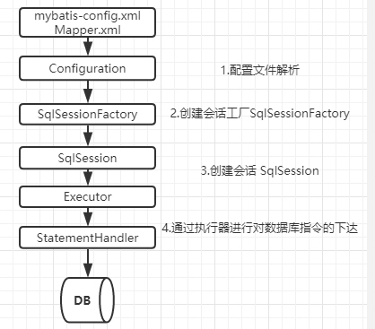

# 作用域（Scope）和生命周期

不同作用域和生命周期类别是至关重要的，因为错误的使用会导致非常严重的并发问题。

## 1. Mybatis 工作流程

### 1.1. SqlSessionFactoryBuilder

- 这个类可以被实例化、使用和丢弃，一旦创建了 `SqlSessionFactory`，就不再需要它了。

- `SqlSessionFactoryBuilder `实例的最佳作用域是方法作用域（也就是局部方法变量）。

### 1.2. SqlSessionFactory

- `SqlSessionFactory `一旦被创建就应该在应用的运行期间一直存在。
- 使用 `SqlSessionFactory `的最佳实践是在应用运行期间不要重复创建多次。
- 最佳作用域是应用作用域，最简单的就是使用单例模式或者静态单例模式。

### 1.3. SqlSession

- 每个线程都应该有它自己的 `SqlSession `实例。
- 它的最佳的作用域是请求或方法作用域。
- 打开一个 `SqlSession`，返回一个响应后，就关闭它。 这个关闭操作很重要。
- 这个关闭操作**最好**放到 `finally `块中。
