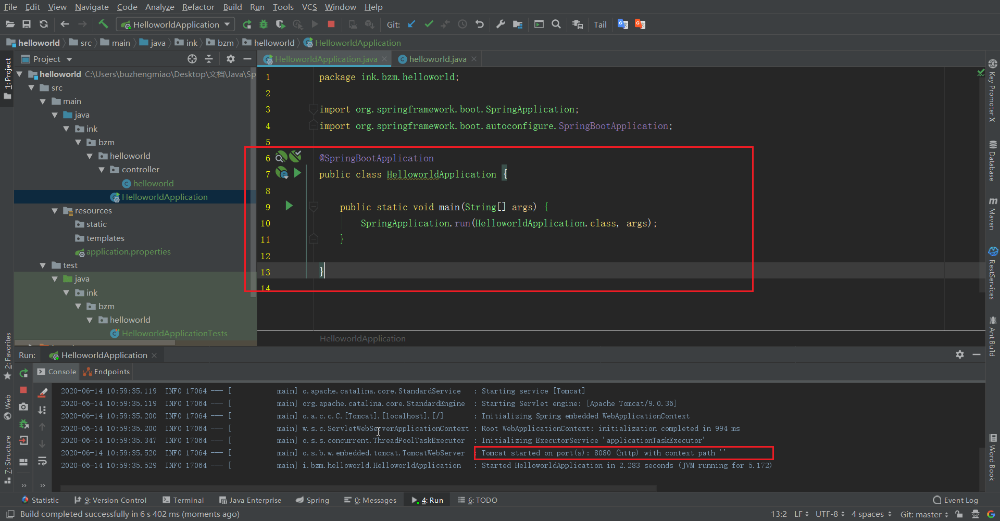
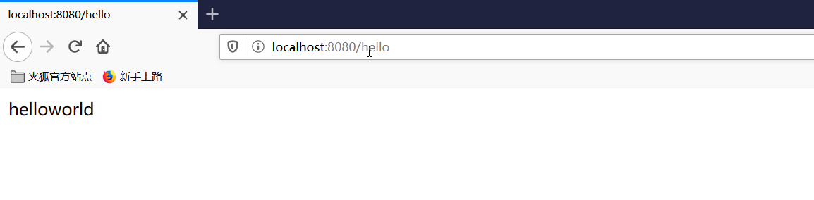
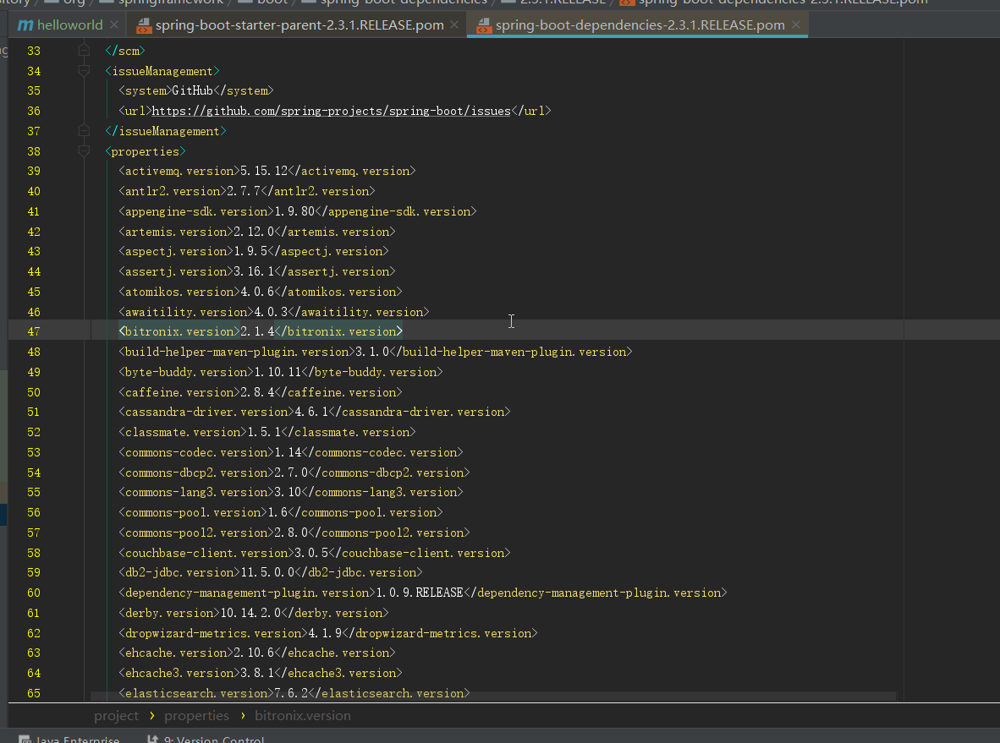
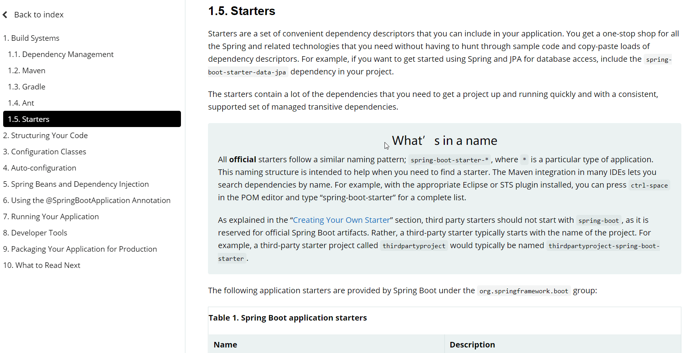
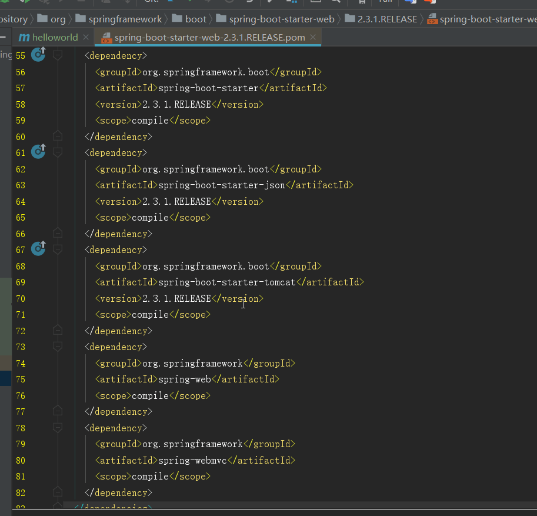
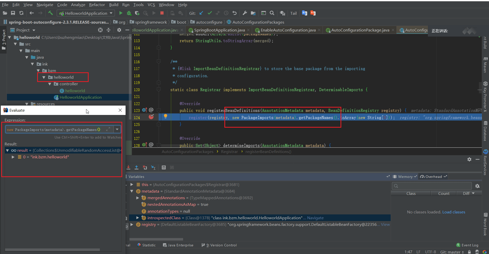
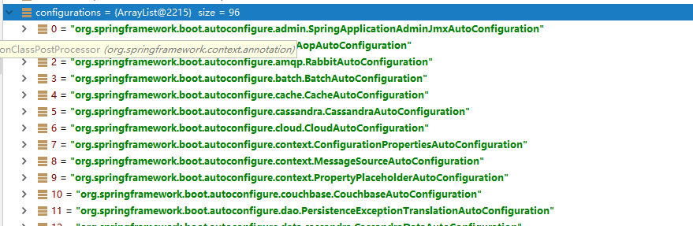

# SpringBoot 快速开始

## 1. helloworld

### 1.1. 创建一个 maven 工程；（jar）

### 1.2. 导入 spring boot 相关的依赖

```xml
<parent>
    <groupId>org.springframework.boot</groupId>
    <artifactId>spring-boot-starter-parent</artifactId>
    <version>2.3.1.RELEASE</version>
</parent>
<dependencies>
    <dependency>
        <groupId>org.springframework.boot</groupId>
        <artifactId>spring-boot-starter-web</artifactId>
    </dependency>
</dependencies>
```

### 1.3. 编写一个主程序；启动 Spring Boot 应用

```java
/**
 *  @SpringBootApplication 来标注一个主程序类，说明这是一个Spring Boot应用
 */
@SpringBootApplication
public class HelloWorldMainApplication {

    public static void main(String[] args) {

        // Spring应用启动起来
        SpringApplication.run(HelloWorldMainApplication.class,args);
    }
}
```

### 1.4. 编写相关的 Controller、Service

```java
@Controller
public class HelloController {

    @ResponseBody
    @RequestMapping("/hello")
    public String hello(){
        return "Hello World!";
    }
}

```

### 1.5. 运行主程序测试





### 1.6. 简化部署

```xml
 <!-- 这个插件，可以将应用打包成一个可执行的jar包；-->
    <build>
        <plugins>
            <plugin>
                <groupId>org.springframework.boot</groupId>
                <artifactId>spring-boot-maven-plugin</artifactId>
            </plugin>
        </plugins>
    </build>
```

将这个应用打成`jar`包，直接使用`java -jar`的命令进行执行；

## 2. POM 文件

### 2.1. 父项目

```xml
<parent>
    <groupId>org.springframework.boot</groupId>
    <artifactId>spring-boot-starter-parent</artifactId>
    <version>2.3.1.RELEASE</version>
    <relativePath/> <!-- lookup parent from repository -->
</parent>

它的父项目
<parent>
    <groupId>org.springframework.boot</groupId>
    <artifactId>spring-boot-dependencies</artifactId>
    <version>2.3.1.RELEASE</version>
</parent>
```

> 他来真正管理Spring Boot应用里面的所有依赖版本



> `Spring Boot`的版本仲裁中心,以后导入依赖，默认是不需要写版本的

**如果对默认的版本不满意需要修改，在当前项目的pom中重写即可**

```xml
<properties>
    <mysql.version>5.1.43</mysql.version>
</properties>
```


### 2.2. 启动器

**场景启动器是一组方便的依赖描述符，可以包含在应用程序中。**

官方关于[Starters](https://docs.spring.io/spring-boot/docs/current/reference/html/using-spring-boot.html#using-boot-starter)的描述



```xml
<dependency>
    <groupId>org.springframework.boot</groupId>
    <artifactId>spring-boot-starter-web</artifactId>
</dependency>
```

> **spring-boot-starter**-**web**：
>
>  `spring-boot-starter`：`spring-boot`场景启动器；帮我们导入了`web`模块正常运行所依赖的组件；



> `SpringBoot`将所有的功能场景都抽取出来，做成一个个的`starter`**（启动器）**，只需要在项目中引入这些`starter`即可，所有相关的依赖都会导入进来 ， 我们**要用什么功能就导入什么样的场景启动器**即可 ；我们未来也可以自己自定义 `starter`；

## 3. 主启动类

```java
@SpringBootApplication
public class HelloworldApplication {

    public static void main(String[] args) {
        SpringApplication.run(HelloworldApplication.class, args);
    }
}
```

**<u>@SpringBootApplication</u>**

**作用：**标注在某个类上说明这个类是`SpringBoot`的**主配置类** ， `SpringBoot`就应该运行这个类的`main`方法来启动`SpringBoot`应用；

```java
//进入这个注解
@Target(ElementType.TYPE)
@Retention(RetentionPolicy.RUNTIME)
@Documented
@Inherited
@SpringBootConfiguration
@EnableAutoConfiguration
@ComponentScan(excludeFilters = { @Filter(type = FilterType.CUSTOM, classes = TypeExcludeFilter.class),
		@Filter(type = FilterType.CUSTOM, classes = AutoConfigurationExcludeFilter.class) })
public @interface SpringBootApplication {
```

<u>**@SpringBootConfiguration**</u>

**作用：**`SpringBoot`的配置类 ，标注在某个类上 ， 表示这是一个`SpringBoot`的配置类；

```java
@Target(ElementType.TYPE)
@Retention(RetentionPolicy.RUNTIME)
@Documented
@Configuration	//配置
public @interface SpringBootConfiguration {
```

 @**Configuration**:配置类上来标注这个注解；

 配置类 ----- 配置文件；配置类也是容器中的一个组件；`@Component`

**<u>@EnableAutoConfiguration</u>**

**作用：**开启自动配置功能

> 以前我们需要自己配置的东西，而现在`SpringBoot`可以自动帮我们配置 ；`@EnableAutoConfiguration`告诉`SpringBoot`开启自动配置功能，这样自动配置才能生效；

```java
// 进入这个注解
@Target(ElementType.TYPE)
@Retention(RetentionPolicy.RUNTIME)
@Documented
@Inherited
@AutoConfigurationPackage
@Import(AutoConfigurationImportSelector.class)
public @interface EnableAutoConfiguration {
```

**<u>@AutoConfigurationPackage：自动配置包</u>**

```java
@Import(AutoConfigurationPackages.Registrar.class)
public @interface AutoConfigurationPackage {
```

> **@import** ：`Spring`底层注解@import ， 给容器中自动创建出这两个类型的组件、默认组件的名字就是全类名
>
> `Registrar.class` 作用：**将主启动类的所在包及包下面所有子包**里面的所有组件扫描到`Spring`容器 ；



**@Import({AutoConfigurationImportSelector.class}) ：给容器导入组件 ;**

> `AutoConfigurationImportSelector`：自动配置导入选择器，

将所有需要导入的组件以全类名的方式返回；这些组件就会被添加到容器中；

 会给容器中导入非常多的自动配置类（xxxAutoConfiguration）；就是给容器中导入这个场景需要的所有组件，并配置好这些组件； 

**有了自动配置类，免去了我们手动编写配置注入功能组件等的工作；**

 SpringFactoriesLoader.loadFactoryNames(EnableAutoConfiguration.class,classLoader)；

`Spring Boot`在启动的时候从类路径下的`META-INF/spring.factories`中获取`EnableAutoConfiguration`指定的值，**将这些值作为自动配置类导入到容器中**，自动配置类就生效，帮我们进行自动配置工作；以前我们需要自己配置的东西，自动配置类都帮我们；
