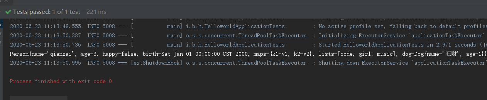
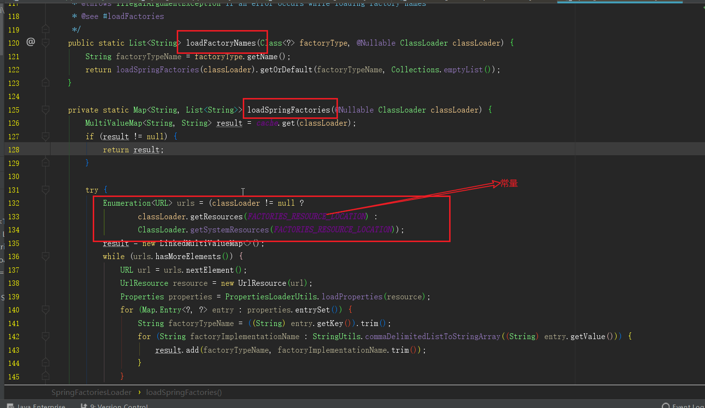
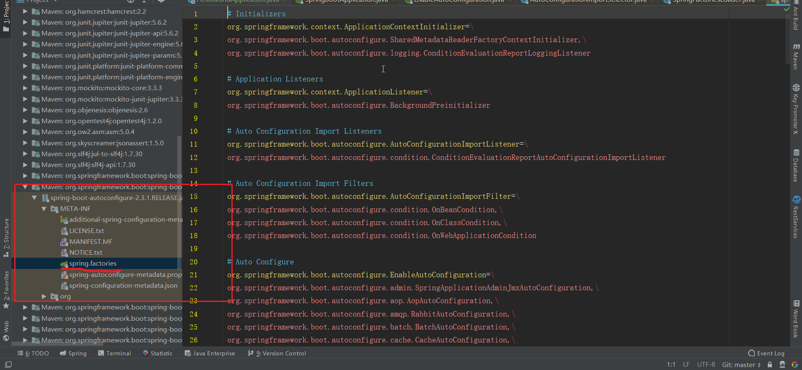
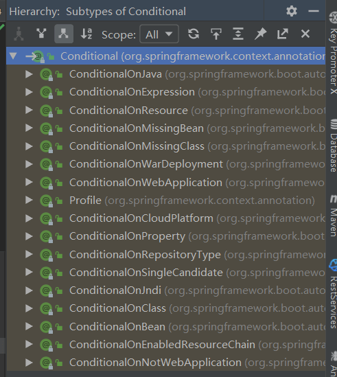
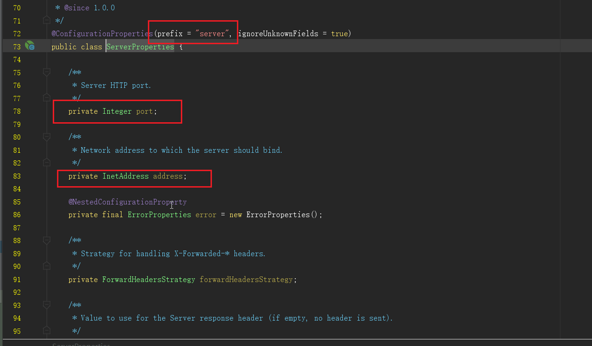
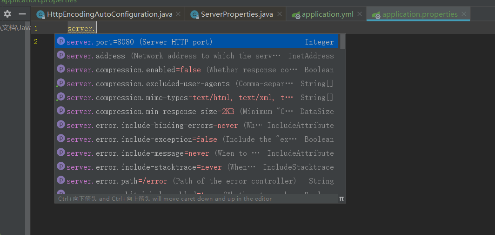

# Spring Boot 配置

## 1. 配置文件

`SpringBoot`使用一个全局的配置文件，**配置文件名是固定的**；

- application.properties

- application.yml

> 配置文件的作用：修改`SpringBoot`自动配置的默认值；`SpringBoot`在底层都给我们自动配置好；

`YAML`是 `"YAML Ain't a Markup Language"`（`YAML`不是一种标记语言）的递归缩写。在开发的这种语言时，`YAML` 的意思其实是：`"Yet Another Markup Language"`（仍是一种标记语言）

**这种语言以数据作为中心，而不是以标记语言为重点！**

`YAML`：配置例子

```yaml
server:
  port: 8081
```

`XML`：

```xml
<server>
	<port>8081</port>
</server>
```

::: details 能配置哪些内容呢？
可以查看官方文档：[Common Application properties](https://docs.spring.io/spring-boot/docs/current/reference/html/appendix-application-properties.html#common-application-properties)

:::

## 2. YAML 语法：

### 2.1. 基本语法

> k:(空格)v：表示一对键值对（空格必须有）；

以**空格**的缩进来控制层级关系；只要是左对齐的一列数据，都是同一个层级的

```yaml
server:
  port: 8081
```

属性和值也是大小写敏感；

### 2.2. 值的写法

**字面量：普通的值（数字，字符串，布尔）**

 k: v：字面直接来写；

 字符串默认不用加上单引号或者双引号；

 ""：双引号；不会转义字符串里面的特殊字符；特殊字符会作为本身想表示的意思

 name: "zhangsan \n lisi"：输出；zhangsan 换行 lisi

 ''：单引号；会转义特殊字符，特殊字符最终只是一个普通的字符串数据

 name: ‘zhangsan \n lisi’：输出；zhangsan \n lisi

**对象、Map（属性和值）（键值对）：**

 k: v：在下一行来写对象的属性和值的关系；注意缩进

 对象还是 k: v 的方式

```yaml
friends:
lastName: zhangsan
age: 20
```

行内写法：

```yaml
friends: { lastName: zhangsan, age: 18 }
```

**数组（List、Set）：**

用- 值表示数组中的一个元素

```yaml
pets:
  - cat
  - dog
  - pig
```

行内写法

```yaml
pets: [cat, dog, pig]
```

## 3. 配置文件值注入

### 3.1. 配置文件

```yaml
person:
  name: qianzai
  age: 3
  happy: false
  birth: 2000/01/01
  maps: { k1: v1, k2: v2 }
  lists:
    - code
    - girl
    - music
  dog:
    name: 旺财
    age: 1
```

### 3.2. javaBean

```java
/**
 * 将配置文件中配置的每一个属性的值，映射到这个组件中
 * @ConfigurationProperties：告诉SpringBoot将本类中的所有属性和配置文件中相关的配置进行绑定；
 *      prefix = "person"：配置文件中哪个下面的所有属性进行一一映射
 *
 * 只有这个组件是容器中的组件，才能容器提供的@ConfigurationProperties功能；
 *
 */
@Component
@ConfigurationProperties(prefix = "person")		//默认是全局配置文件,application.yml
public class Person {

    private String lastName;
    private Integer age;
    private Boolean boss;
    private Date birth;

    private Map<String,Object> maps;
    private List<Object> lists;
    private Dog dog;

```

我们可以导入配置文件处理器，以后编写配置就有提示了

```xml
<!--导入配置文件处理器，配置文件进行绑定就会有提示-->
		<dependency>
			<groupId>org.springframework.boot</groupId>
			<artifactId>spring-boot-configuration-processor</artifactId>
			<optional>true</optional>
		</dependency>
```

### 3.3. 测试

```java
@Autowired
Person person; //将person自动注入进来


@Test
public void contextLoads() {
    System.out.println(person); //打印person信息
}
```



### 3.4. @Value 获取值和@ConfigurationProperties 获取值比较

|                      | @ConfigurationProperties | @Value     |
| -------------------- | ------------------------ | ---------- |
| 功能                 | 批量注入配置文件中的属性 | 一个个指定 |
| 松散绑定（松散语法） | 支持                     | 不支持     |
| SpEL                 | 不支持                   | 支持       |
| JSR303 数据校验      | 支持                     | 不支持     |
| 复杂类型封装         | 支持                     | 不支持     |

配置文件`yml`还是`properties`他们都能获取到值；

如果说，我们只是在某个业务逻辑中需要获取一下配置文件中的某项值，使用`@Value`；

如果说，我们专门编写了一个`javaBean`来和配置文件进行映射，我们就直接使用`@ConfigurationProperties`；

## 4. 加载指定的配置文件

### 4.1. @Bean

> 将方法的返回值添加到容器中；

- 容器中这个组件默认的 id 就是方法名
- 默认是单实例的
- 外部无论调用多少次都是之前注入到容器的单实例对象

```java
@Configuration(proxyBeanMethods = true)	///告诉SpringBoot这是一个配置类
public class MyConfig {

    @Bean	//给容器中添加组件
    public HelloService helloService() {
        return new HelloService();
    }

}
```

> 被`@Configuration`标注的类就是一个配置类，配置类也是一个组件

- `Full`(proxyBeanMethods = true)：**保证每个@Bean 方法被调用多少次返回的组件都是单实例的**
- `Lite`(proxyBeanMethods = false)：**每个@Bean 方法被调用多少次返回的组件都是新创建的**

> 如果在只是在容器中注册组件，而别人也不依赖他，一般使用`Lite`，反之使用`Full`

### 4.2. @PropertySource

> 加载指定的配置文件；

实体类

```java
@Component //注册bean
@PropertySource(value = "classpath:user.properties")	//加载指定的配置文件
public class User {
    @Value("${name}")
    private String name;
    @Value("${age}")
    private int age;
    @Value("${sex}")
    private String sex;
```

user.properties

```properties
name=qianzai
age=18
sex="男"
```

测试

```java
@Autowired
User user;

@Test
public void contextLoads() {
    System.out.println(user);
```

### 4.3. @ImportResource：

> 导入 Spring 的配置文件，让配置文件里面的内容生效；

`Spring Boot`里面没有`Spring`的配置文件，我们自己编写的配置文件，也不能自动识别；

想让`Spring`的配置文件生效，加载进来；@**ImportResource**标注在一个配置类上

```java
@ImportResource(locations = {"classpath:beans.xml"})
导入Spring的配置文件让其生效
```

## 5. 配置文件占位符

### 5.1. 随机数

```properties
${random.value}、${random.int}、${random.long}
${random.int(10)}、${random.int[1024,65536]}
```

### 5.2. 占位符

> 获取之前配置的值，如果没有可以是用:指定默认值

```properties
person.last-name=张三${random.uuid}
person.age=${random.int}
person.birth=2017/12/15
person.boss=false
person.maps.k1=v1
person.maps.k2=14
person.lists=a,b,c
person.dog.name=${person.hello:hello}_dog 	#如果person.hello值不存在，默认使用:后面的值
person.dog.age=15
```

## 6. Profile

### 6.1. 多 Profile 文件

我们在主配置文件编写的时候，文件名可以是 `application-{profile}.properties/yml`

默认使用`application.properties`的配置；

### 6.2. yml 支持多文档块方式

```yml
server:
  port: 8081
spring:
  profiles:
    active: prod

---
server:
  port: 8083
spring:
  profiles: dev

---
server:
  port: 8084
spring:
  profiles: prod #指定属于哪个环境
```

### 6.3. 激活指定 profile

 1、在配置文件中指定 `spring.profiles.active=dev`

 2、命令行：

```shell
java -jar spring-boot-02-config-0.0.1-SNAPSHOT.jar --spring.profiles.active=dev；
```

 可以直接在测试的时候，配置传入命令行参数

 3、虚拟机参数；

```shell
-Dspring.profiles.active=dev
```

## 7. 配置文件加载位置

`springboot`启动会扫描以下位置的`application.properties`或者`application.yml`文件作为`Spring boot`的默认配置文件

–file:./config/

–file:./

–classpath:/config/

–classpath:/

优先级由高到低，高优先级的配置会覆盖低优先级的配置；

`SpringBoot`会从这四个位置全部加载主配置文件；**互补配置**；

> 我们还可以通过`spring.config.location`来改变默认的配置文件位置

## 8. 外部配置加载顺序

> `SpringBoot`也可以从以下位置加载配置； 优先级从高到低；高优先级的配置覆盖低优先级的配置，所有的配置会形成**互补配置**

[参考官方文档](https://docs.spring.io/spring-boot/docs/2.2.5.RELEASE/reference/htmlsingle/#boot-features-external-config)

1、命令行参数

```shell
java -jar spring-boot-02-config-02-0.0.1-SNAPSHOT.jar --server.port=8087  --server.context-path=/abc
```

2.来自`java:comp/env`的`JNDI`属性

3.`Java`系统属性（`System.getProperties()`）

4.操作系统环境变量

5.`RandomValuePropertySource`配置的`random.*`属性值

> ==**由 jar 包外向 jar 包内进行寻找；**==
>
> ==**优先加载带 profile**==

6.jar 包外部的 application-{profile}.properties 或 application.yml(带 spring.profile)配置文件

7.jar 包内部的 application-{profile}.properties 或 application.yml(带 spring.profile)配置文件

8.jar 包外部的 application.properties 或 application.yml(不带 spring.profile)配置文件

9.jar 包内部的 application.properties 或 application.yml(不带 spring.profile)配置文件

10.`@Configuration`注解类上的`@PropertySource`

11.通过`SpringApplication.setDefaultProperties`指定的默认属性

---

## 9. 自动配置

### 9.1. 默认的包结构

- - 主程序所在包及其下面的所有子包里面的组件都会被默认扫描进来
  - 无需以前的包扫描配置
  - 想要改变扫描路径，@SpringBootApplication(scanBasePackages=**"com.XXX"**)

- - - 或者@ComponentScan 指定扫描路径

```java
@SpringBootApplication
等同于
@SpringBootConfiguration
@EnableAutoConfiguration
@ComponentScan("com.bzm.boot")
```

### 9.2. 配置文件能写什么？

[配置文件能配置的属性参照](https://docs.spring.io/spring-boot/docs/1.5.9.RELEASE/reference/htmlsingle/#common-application-properties)


### 9.3. 自动配置原理

[自动配置原理](https://juejin.im/post/5ca4e19b51882543d3780464)

[雷丰阳 SpringBoot 自动配置讲解](https://www.bilibili.com/video/BV1Et411Y7tQ?p=18)

1、`SpringBoot`启动的时候**加载主配置类**，开启了自动配置功能 ==@EnableAutoConfiguration==

```java
@SpringBootApplication
public class HelloworldApplication {

    public static void main(String[] args) {
        SpringApplication.run(HelloworldApplication.class, args);
    }

}
```

> 进入`@SpringBootApplication`

```java
@Target(ElementType.TYPE)
@Retention(RetentionPolicy.RUNTIME)
@Documented
@Inherited
@SpringBootConfiguration
@EnableAutoConfiguration	//开启自动配置
@ComponentScan(excludeFilters = { @Filter(type = FilterType.CUSTOM, classes = TypeExcludeFilter.class),
		@Filter(type = FilterType.CUSTOM, classes = AutoConfigurationExcludeFilter.class) })
public @interface SpringBootApplication {
```

2、再进入 `@EnableAutoConfiguration`源码，发现最重要的就是 `@Import(AutoConfigurationImportSelector.class)` 这个注解，其中的 `AutoConfigurationImportSelector`类的作用就是往 `Spring`容器中导入组件

```java
@Target(ElementType.TYPE)
@Retention(RetentionPolicy.RUNTIME)
@Documented
@Inherited
@AutoConfigurationPackage
@Import(AutoConfigurationImportSelector.class)
public @interface EnableAutoConfiguration {
```

> 进入这个类的源码，发现有这几个方法

```java
/**
* 方法用于给容器中导入组件
**/
@Override
public String[] selectImports(AnnotationMetadata annotationMetadata) {
    if (!isEnabled(annotationMetadata)) {
        return NO_IMPORTS;
    }
    AutoConfigurationMetadata autoConfigurationMetadata = AutoConfigurationMetadataLoader
        .loadMetadata(this.beanClassLoader);
    AutoConfigurationEntry autoConfigurationEntry = getAutoConfigurationEntry(
        autoConfigurationMetadata, annotationMetadata);  // 获取自动配置项
    return StringUtils.toStringArray(autoConfigurationEntry.getConfigurations());
}

// 获取自动配置项
protected AutoConfigurationEntry getAutoConfigurationEntry(
    AutoConfigurationMetadata autoConfigurationMetadata,
    AnnotationMetadata annotationMetadata) {
    if (!isEnabled(annotationMetadata)) {
        return EMPTY_ENTRY;
    }
    AnnotationAttributes attributes = getAttributes(annotationMetadata);
    List < String > configurations = getCandidateConfigurations(annotationMetadata,
        attributes);  //  获取一个自动配置 List ，这个 List 就包含了所有自动配置的类名
    configurations = removeDuplicates(configurations);
    Set < String > exclusions = getExclusions(annotationMetadata, attributes);
    checkExcludedClasses(configurations, exclusions);
    configurations.removeAll(exclusions);
    configurations = filter(configurations, autoConfigurationMetadata);
    fireAutoConfigurationImportEvents(configurations, exclusions);
    return new AutoConfigurationEntry(configurations, exclusions);
}

//   获取一个自动配置 List ，这个 List 就包含了所有的自动配置的类名
protected List < String > getCandidateConfigurations(AnnotationMetadata metadata,
    AnnotationAttributes attributes) {
    // 通过 getSpringFactoriesLoaderFactoryClass 获取默认的 EnableAutoConfiguration.class 类名，传入 loadFactoryNames 方法
    List < String > configurations = SpringFactoriesLoader.loadFactoryNames(
        getSpringFactoriesLoaderFactoryClass(), getBeanClassLoader());
    Assert.notEmpty(configurations,
        "No auto configuration classes found in META-INF/spring.factories. If you " +
        "are using a custom packaging, make sure that file is correct.");
    return configurations;
}

// 默认的 EnableAutoConfiguration.class 类名
protected Class<?> getSpringFactoriesLoaderFactoryClass() {
	return EnableAutoConfiguration.class;
}
```

>     获取一个自动配置 `List `，这个 `List `就包含了所有自动配置的类名
>
>     ```java
>     List<String> configurations = getCandidateConfigurations(annotationMetadata, attributes);
>     ```

跳转到`getCandidateConfigurations()`方法

```java
	protected List<String> getCandidateConfigurations(AnnotationMetadata metadata, AnnotationAttributes attributes) {
		List<String> configurations = SpringFactoriesLoader.loadFactoryNames(getSpringFactoriesLoaderFactoryClass(),
				getBeanClassLoader());
		Assert.notEmpty(configurations, "No auto configuration classes found in META-INF/spring.factories. If you "
				+ "are using a custom packaging, make sure that file is correct.");
		return configurations;
	}
```

3、进入`SpringFactoriesLoader`的`loadFactoryNames`方法，`loadSpringFactories`方法发现 `ClassLoader`类加载器指定了一个 **FACTORIES_RESOURCE_LOCATION** 常量。

```java
public static List < String > loadFactoryNames(Class < ? > factoryClass, @Nullable ClassLoader classLoader) {
    String factoryClassName = factoryClass.getName();
    return loadSpringFactories(classLoader).getOrDefault(factoryClassName, Collections.emptyList());
}

private static Map < String, List < String >> loadSpringFactories(@Nullable ClassLoader classLoader) {
    MultiValueMap < String, String > result = cache.get(classLoader);
    if (result != null) {
        return result;
    }

    try {
        // 扫描所有 jar 包类路径下  META-INF/spring.factories
        Enumeration < URL > urls = (classLoader != null ?
            classLoader.getResources(FACTORIES_RESOURCE_LOCATION) :
            ClassLoader.getSystemResources(FACTORIES_RESOURCE_LOCATION));
        result = new LinkedMultiValueMap < > ();
        while (urls.hasMoreElements()) {
            URL url = urls.nextElement();
            UrlResource resource = new UrlResource(url);
            // 把扫描到的这些文件的内容包装成 properties 对象
            Properties properties = PropertiesLoaderUtils.loadProperties(resource);
            for (Map.Entry < ? , ? > entry : properties.entrySet()) {
                String factoryClassName = ((String) entry.getKey()).trim();
                for (String factoryName: StringUtils.commaDelimitedListToStringArray((String) entry.getValue())) {
                    // 从 properties 中获取到 EnableAutoConfiguration.class 类（类名）对应的值，然后把他们添加在容器中
                    result.add(factoryClassName, factoryName.trim());
                }
            }
        }
        cache.put(classLoader, result);
        return result;
    } catch (IOException ex) {
        throw new IllegalArgumentException("Unable to load factories from location [" +
            FACTORIES_RESOURCE_LOCATION + "]", ex);
    }
}
```

> 然后利用`PropertiesLoaderUtils`把 `ClassLoader`扫描到的这些文件的内容包装成 `properties` 对象，从 `properties`中获取到 `EnableAutoConfiguration.class` 类（类名）对应的值，然后把他们添加在容器中。



```java
public static final String FACTORIES_RESOURCE_LOCATION = "META-INF/spring.factories";
```

4、将类路径下 `META-INF/spring.factories`里面配置的所有 `EnableAutoConfiguration`的值加入到了容器中



每一个这样的 `xxxAutoConfiguration`类都是容器中的一个组件，都加入到容器中，用他们来做自动配置。上述的每一个自动配置类都有自动配置功能，也可在配置文件中自定义配置。

### 9.4. 举例说明 Http 编码自动配置原理

**@ConditionalOnWebApplication**

Spring 底层 @Conditional 注解，根据不同的条件，如果满足指定的条件，整个配置类里面的配置就会生效；判断当前应用是否是 web 应用，如果是，当前配置类生效

- @Conditional 接口结构层次

  

```java
@Configuration
// 表示这是一个配置类，以前编写的配置文件一样，也可以给容器中添加组件

@EnableConfigurationProperties(ServerProperties.class)
// 启动指定类的 ConfigurationProperties 功能；将配置文件中对应的值和 ServerProperties 绑定起来；并把 ServerProperties 加入到 ioc 容器中

@ConditionalOnWebApplication

@ConditionalOnClass(CharacterEncodingFilter.class)
// 判断当前项目有没有这个类 CharacterEncodingFilter；SpringMVC 中进行乱码解决的过滤器；

@ConditionalOnProperty(prefix = "spring.http.encoding", value = "enabled", matchIfMissing = true)
// 判断配置文件中是否存在某个配置  spring.http.encoding.enabled；如果不存在，判断也是成立的
// 即使我们配置文件中不配置 pring.http.encoding.enabled=true，也是默认生效的；
public class HttpEncodingAutoConfiguration {

    // 已经和 SpringBoot 的配置文件建立映射关系了
    private final ServerProperties properties;

    //只有一个有参构造器的情况下，参数的值就会从容器中拿
    public HttpEncodingAutoConfiguration(ServerProperties properties) {
        this.properties = properties;
    }

    @Bean
    // 给容器中添加一个组件，这个组件的某些值需要从 properties 中获取
    @ConditionalOnMissingBean(CharacterEncodingFilter.class)
    public CharacterEncodingFilter characterEncodingFilter() {
        CharacterEncodingFilter filter = new OrderedCharacterEncodingFilter();
        filter.setEncoding(this.properties.getCharset().name());
        filter.setForceRequestEncoding(this.properties.shouldForce(Type.REQUEST));
        filter.setForceResponseEncoding(this.properties.shouldForce(Type.RESPONSE));
        return filter;
    }
```

> 所有在配置文件中能配置的属性都是在 `xxxxProperties`类中封装的；配置文件能配置什么就可以参照某个功能对应的这个属性类



```markdown
然后里面的属性都是，可以在配置文件中指定的。前缀就是 server。
```



### 9.5. 总结

**1）、SpringBoot 启动会加载大量的自动配置类**

**2）、我们看我们需要的功能有没有 SpringBoot 默认写好的自动配置类；**

**3）、我们再来看这个自动配置类中到底配置了哪些组件；（只要我们要用的组件有，我们就不需要再来配置了）**

**4）、给容器中自动配置类添加组件的时候，会从 properties 类中获取某些属性。我们就可以在配置文件中指定这些属性的值；**

xxxxAutoConfigurartion：自动配置类；

给容器中添加组件

xxxxProperties:封装配置文件中相关属性；

---

## 10. @Conditional 派生注解

> （Spring 注解版原生的@Conditional 作用）

作用：必须是@Conditional 指定的条件成立，才给容器中添加组件，配置配里面的所有内容才生效；

| @Conditional 扩展注解           | 作用（判断是否满足当前指定条件）                     |
| ------------------------------- | ---------------------------------------------------- |
| @ConditionalOnJava              | 系统的 java 版本是否符合要求                         |
| @ConditionalOnBean              | 容器中存在指定 Bean；                                |
| @ConditionalOnMissingBean       | 容器中不存在指定 Bean；                              |
| @ConditionalOnExpression        | 满足 SpEL 表达式指定                                 |
| @ConditionalOnClass             | 系统中有指定的类                                     |
| @ConditionalOnMissingClass      | 系统中没有指定的类                                   |
| @ConditionalOnSingleCandidate   | 容器中只有一个指定的 Bean，或者这个 Bean 是首选 Bean |
| @ConditionalOnProperty          | 系统中指定的属性是否有指定的值                       |
| @ConditionalOnResource          | 类路径下是否存在指定资源文件                         |
| @ConditionalOnWebApplication    | 当前是 web 环境                                      |
| @ConditionalOnNotWebApplication | 当前不是 web 环境                                    |
| @ConditionalOnJndi              | JNDI 存在指定项                                      |

## 11. 判断配置文件生效

我们怎么知道哪些自动配置类生效；

**我们可以通过启用 debug=true 属性；来让控制台打印自动配置报告**，这样我们就可以很方便的知道哪些自动配置类生效；

```java
=========================
AUTO-CONFIGURATION REPORT
=========================


Positive matches:（自动配置类启用的）
-----------------

   DispatcherServletAutoConfiguration matched:
      - @ConditionalOnClass found required class 'org.springframework.web.servlet.DispatcherServlet'; @ConditionalOnMissingClass did not find unwanted class (OnClassCondition)
      - @ConditionalOnWebApplication (required) found StandardServletEnvironment (OnWebApplicationCondition)


Negative matches:（没有启动，没有匹配成功的自动配置类）
-----------------

   ActiveMQAutoConfiguration:
      Did not match:
         - @ConditionalOnClass did not find required classes 'javax.jms.ConnectionFactory', 'org.apache.activemq.ActiveMQConnectionFactory' (OnClassCondition)

   AopAutoConfiguration:
      Did not match:
         - @ConditionalOnClass did not find required classes 'org.aspectj.lang.annotation.Aspect', 'org.aspectj.lang.reflect.Advice' (OnClassCondition)

```
