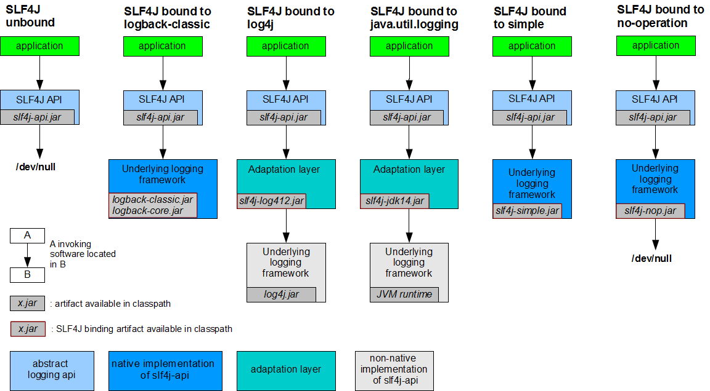
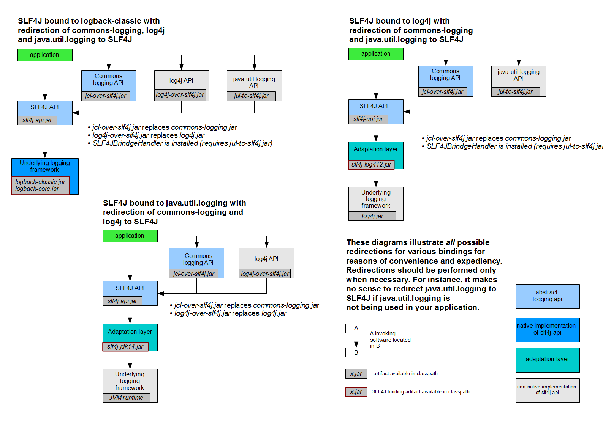
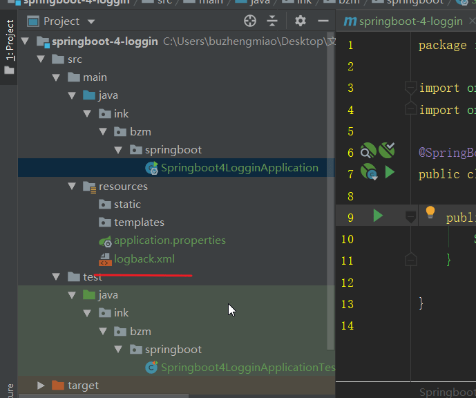
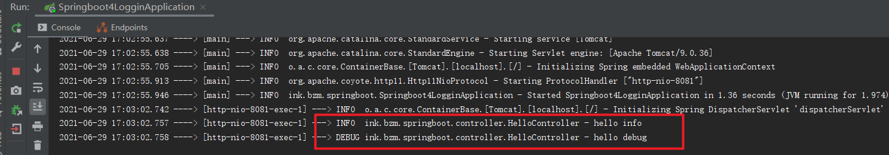

# SpringBoot 与日志

## 1. 市面上的日志框架

`JUL`、`JCL`、`Jboss-logging`、`logback`、`log4j`、`log4j2`、`slf4j....`

| 日志门面 （日志的抽象层）                                                                        | 日志实现                                          |
| ------------------------------------------------------------------------------------------------ | ------------------------------------------------- |
| ~~JCL（Jakarta Commons Logging）~~ SLF4j（Simple Logging Facade for Java） **~~jboss-logging~~** | Log4j JUL（java.util.logging） Log4j2 **Logback** |

> - 底层是`Spring`框架，`Spring`框架默认是用`JCL`；
>
> - `SpringBoot`选用 `SLF4j`和`logback`；

## 2. SLF4j 使用

[SLF4j](https://www.slf4j.org)

> 开发的时候，日志记录方法的调用，不应该来直接调用日志的实现类，而是**调用日志抽象层里面的方法**；
>
> 给系统里面导入`slf4j`的`jar`和 `logback`的实现`jar`

```java
import org.slf4j.Logger;
import org.slf4j.LoggerFactory;

public class HelloWorld {
  public static void main(String[] args) {
    Logger logger = LoggerFactory.getLogger(HelloWorld.class);
    logger.info("Hello World");
  }
}
```

图示；



## 3. 统一日志记录

> 开发时候，可能用到很多框架，底层适配的日志系统可能不一样，如果进行统一呢？
>
> `a（slf4j+logback）: Spring（commons-logging）、Hibernate（jboss-logging）、MyBatis、xxxx`

_统一日志记录，即使是别的框架和我一起统一使用 slf4j 进行输出？_



**如何让系统中所有的日志都统一到 slf4j；**

==1、将系统中其他日志框架先排除出去；==

==2、用中间包来替换原有的日志框架；==

==3、我们导入 slf4j 其他的实现==

```xml
<dependency>
    <groupId>org.springframework.boot</groupId>
    <artifactId>spring-boot-starter-logging</artifactId>
    <version>2.3.1.RELEASE</version>
    <scope>compile</scope>
</dependency>
```

## 4. SpringBoot 日志使用

### 4.1. 默认配置

`SpringBoot`默认帮我们配置好了日志,**直接使用即可**；

> `spring-boot-starter`中已经导入了

```java
//记录器
Logger logger = LoggerFactory.getLogger(getClass());
@Test
public void contextLoads() {
    //System.out.println();

    //日志的级别；
    //由低到高   trace<debug<info<warn<error
    //可以调整输出的日志级别；日志就只会在这个级别以以后的高级别生效
    logger.trace("这是trace日志...");
    logger.debug("这是debug日志...");
    //SpringBoot默认给我们使用的是info级别的，没有指定级别的就用SpringBoot默认规定的级别；root级别
    logger.info("这是info日志...");
    logger.warn("这是warn日志...");
    logger.error("这是error日志...");
}
```

`application.properties`

```properties
logging.level.ink.bzm.springboot=trace

logging.path=
 不指定路径在当前项目下生成springboot.log日志
 可以指定完整的路径；
logging.file=G:/springboot.log

 在当前磁盘的根路径下创建spring文件夹和里面的log文件夹；使用 spring.log 作为默认文件
logging.path=/spring/log

  在控制台输出的日志的格式
logging.pattern.console=%d{yyyy-MM-dd} [%thread] %-5level %logger{50} - %msg%n
 指定文件中日志输出的格式
logging.pattern.file=%d{yyyy-MM-dd} === [%thread] === %-5level === %logger{50} ==== %msg%n
```

[logback 日志配置文件](../资料/logback.xml)

```properties
    日志输出格式：
		%d表示日期时间，
		%thread表示线程名，
		%-5level：级别从左显示5个字符宽度
		%logger{50} 表示logger名字最长50个字符，否则按照句点分割。
		%msg：日志消息，
		%n是换行符
    -->
    %d{yyyy-MM-dd HH:mm:ss.SSS} [%thread] %-5level %logger{50} - %msg%n
```

| logging.file | logging.path | Example  | Description                        |
| ------------ | ------------ | -------- | ---------------------------------- |
| (none)       | (none)       |          | 只在控制台输出                     |
| 指定文件名   | (none)       | my.log   | 输出日志到 my.log 文件             |
| (none)       | 指定目录     | /var/log | 输出到指定目录的 spring.log 文件中 |

### 4.2. 指定配置

给类路径下放上每个日志框架自己的配置文件即可；`SpringBoot`就不使用他默认配置的了



| Logging System          | Customization                                                                    |
| ----------------------- | -------------------------------------------------------------------------------- |
| Logback                 | `logback-spring.xml`, `logback-spring.groovy`, `logback.xml` or `logback.groovy` |
| Log4j2                  | `log4j2-spring.xml` or `log4j2.xml`                                              |
| JDK (Java Util Logging) | `logging.properties`                                                             |

**logback.xml**：直接就被日志框架识别了；

**logback-spring.xml**：日志框架就不直接加载日志的配置项，由`SpringBoot`解析日志配置，可以使用`SpringBoot`的高级`Profile`功能

```xml
<springProfile name="dev">
    <!-- configuration to be enabled when the "staging" profile is active -->
  	可以指定某段配置只在某个环境下生效
</springProfile>
```

如：

```xml
<appender name="stdout" class="ch.qos.logback.core.ConsoleAppender">
    <!--
        日志输出格式：
   %d表示日期时间，
   %thread表示线程名，
   %-5level：级别从左显示5个字符宽度
   %logger{50} 表示logger名字最长50个字符，否则按照句点分割。
   %msg：日志消息，
   %n是换行符
        -->
    <layout class="ch.qos.logback.classic.PatternLayout">
        <springProfile name="dev">
            <pattern>%d{yyyy-MM-dd HH:mm:ss.SSS} ----> [%thread] ---> %-5level %logger{50} - %msg%n</pattern>
        </springProfile>
        <springProfile name="!dev">
            <pattern>%d{yyyy-MM-dd HH:mm:ss.SSS} ==== [%thread] ==== %-5level %logger{50} - %msg%n</pattern>
        </springProfile>
    </layout>
</appender>
```

> 如果使用`logback.xml`作为日志配置文件，还要使用`profile`功能，会有以下错误
>
> `no applicable action for [springProfile]`

### 4.3. 切换日志框架

。。。

## 5. 结合 Lombok@Slf4j 注解

### 5.1. 在 pom 中引入依赖

```xml
        <dependency>
            <groupId>org.projectlombok</groupId>
            <artifactId>lombok</artifactId>
        </dependency>
```

### 5.2. IDE 中安装 lombok 插件

File → settings → Plugins

### 5.3. 测试使用

**在类上添加@Slf4j 注解，在方法中直接使用 log**

```java
@Controller
@Slf4j	// 添加注解
public class HelloController {

	@ResponseBody
	@RequestMapping("/hello")
	public String hello(){
		log.info("hello info");
		log.debug("hello debug");
		return "Hello World!";
	}
}
```


