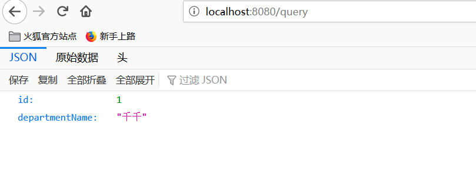

# SpringBoot 与数据源

## 1. 整合 JDBC

### 1.1. SpringBoot 与 JDBC 入门

导入`Pom`依赖

```xml
<dependency>
    <groupId>org.springframework.boot</groupId>
    <artifactId>spring-boot-starter-data-jdbc</artifactId>
</dependency>

<dependency>
    <groupId>mysql</groupId>
    <artifactId>mysql-connector-java</artifactId>
    <scope>runtime</scope>
</dependency>
```

`application.yml`

```yaml
spring:
  datasource:
    username: root
    password: 123456
    url: jdbc:mysql://192.168.200.40:3306/jdbc
    driver-class-name: com.mysql.jdbc.Driver
```

**测试**

```java
    @Autowired
    DataSource dataSource;

    @Test
    void contextLoads() throws SQLException {
//        class com.zaxxer.hikari.HikariDataSource
        System.out.println(dataSource.getClass());

        Connection connection = dataSource.getConnection();
        System.out.println(connection);
        connection.close();
    }
```

**效果：**

 默认是用`com.zaxxer.hikari.HikariDataSource`作为数据源；

 数据源的相关配置都在`DataSourceProperties`里面；

### 1.2. 自动配置原理

> `org.springframework.boot.autoconfigure.jdbc`包下：

1、参考`DataSourceConfiguration`，根据配置创建数据源，默认使用`hikari`连接池；可以使用`spring.datasource.type`指定自定义的数据源类型；

2、`SpringBoot`默认可以支持；

```
org.apache.tomcat.jdbc.pool.DataSource、HikariDataSource、BasicDataSource、
```

3、自定义数据源类型

```java
/**
 * Generic DataSource configuration.
 */
@Configuration(proxyBeanMethods = false)
@ConditionalOnMissingBean(DataSource.class)
@ConditionalOnProperty(name = "spring.datasource.type")
static class Generic {

   @Bean
   DataSource dataSource(DataSourceProperties properties) {
      //使用DataSourceBuilder创建数据源，利用反射创建响应type的数据源，并且绑定相关属性
      return properties.initializeDataSourceBuilder().build();
   }
}
```

4、**DataSourceInitializer：ApplicationListener**；

 作用：

 1）、`runSchemaScripts();`运行建表语句；

 2）、`runDataScripts()`;运行插入数据的`sql`语句；

默认只需要将文件命名为：

```properties
schema-*.sql、data-*.sql
默认规则：schema.sql，schema-all.sql；
可以使用
	schema:
      - classpath:department.sql	#注意classpath后面没有空格
      指定位置
```

5、操作数据库：自动配置了`JdbcTemplate`操作数据库

### 1.3. SpringBoot 与 JDBC 示例

```java
	@Autowired
    JdbcTemplate jdbcTemplate;

    @ResponseBody
    @GetMapping("/query")
    public Map<String,Object> map(){
        List<Map<String, Object>> list = jdbcTemplate.queryForList("select * FROM department");
        return list.get(0);
    }
```



## 2. 整合 Druid 数据源

引入`pom`依赖

```xml
<!--引入druid数据源-->
<dependency>
    <groupId>com.alibaba</groupId>
    <artifactId>druid</artifactId>
    <version>1.1.19</version>
</dependency>
```

配置`application.yml`

```properties
spring:
  datasource:
    username: root
    password: 123456
    url: jdbc:mysql://192.168.200.40:3306/jdbc
    driver-class-name: com.mysql.cj.jdbc.Driver

    initialization-mode: always
    type: com.alibaba.druid.pool.DruidDataSource

    initialSize: 5
    minIdle: 5
    maxActive: 20
    maxWait: 60000
    timeBetweenEvictionRunsMillis: 60000
    minEvictableIdleTimeMillis: 300000
    validationQuery: SELECT 1 FROM DUAL
    testWhileIdle: true
    testOnBorrow: false
    testOnReturn: false
    poolPreparedStatements: true
    #   配置监控统计拦截的filters，去掉后监控界面sql无法统计，'wall'用于防火墙
    filters: stat,wall,log4j
    maxPoolPreparedStatementPerConnectionSize: 20
    useGlobalDataSourceStat: true
    connectionProperties: druid.stat.mergeSql=true;druid.stat.slowSqlMillis=500
```

`DruidConfig`

```java
@Configuration
public class DruidConfig {

    @ConfigurationProperties(prefix = "spring.datasource")
    @Bean
    public DataSource druid(){
       return  new DruidDataSource();
    }

    //配置Druid的监控
    //1、配置一个管理后台的Servlet
    @Bean
    public ServletRegistrationBean statViewServlet(){
        ServletRegistrationBean bean = new ServletRegistrationBean(new StatViewServlet(), "/druid/*");
        Map<String,String> initParams = new HashMap<>();

        initParams.put("loginUsername","admin");
        initParams.put("loginPassword","123456");
        initParams.put("allow","");//默认就是允许所有访问
        initParams.put("deny","192.168.15.21");

        bean.setInitParameters(initParams);
        return bean;
    }

    //2、配置一个web监控的filter
    @Bean
    public FilterRegistrationBean webStatFilter(){
        FilterRegistrationBean bean = new FilterRegistrationBean();
        bean.setFilter(new WebStatFilter());

        Map<String,String> initParams = new HashMap<>();
        initParams.put("exclusions","*.js,*.css,/druid/*");

        bean.setInitParameters(initParams);

        bean.setUrlPatterns(Arrays.asList("/*"));

        return  bean;
    }
}
```

## 3. 整合 MyBatis

引入`pom`依赖

```xml
<!--引入mybatis依赖-->
<dependency>
    <groupId>org.mybatis.spring.boot</groupId>
    <artifactId>mybatis-spring-boot-starter</artifactId>
    <version>2.1.3</version>
</dependency>
<!--引入druid数据源-->
<dependency>
    <groupId>com.alibaba</groupId>
    <artifactId>druid</artifactId>
    <version>1.1.19</version>
</dependency>
```

配置`application.yml`

```yml
spring:
  datasource:
    username: root
    password: 123456
    url: jdbc:mysql://192.168.200.40:3306/mybatis
    driver-class-name: com.mysql.cj.jdbc.Driver
    type: com.alibaba.druid.pool.DruidDataSource
    initialization-mode: always

    schema:
      - classpath:sql/department.sql
      - classpath:sql/employee.sql

    initialSize: 5
    minIdle: 5
    maxActive: 20
    maxWait: 60000
    timeBetweenEvictionRunsMillis: 60000
    minEvictableIdleTimeMillis: 300000
    validationQuery: SELECT 1 FROM DUAL
    testWhileIdle: true
    testOnBorrow: false
    testOnReturn: false
    poolPreparedStatements: true
    #   配置监控统计拦截的filters，去掉后监控界面sql无法统计，'wall'用于防火墙
    filters: stat,wall,log4j
    maxPoolPreparedStatementPerConnectionSize: 20
    useGlobalDataSourceStat: true
    connectionProperties: druid.stat.mergeSql=true;druid.stat.slowSqlMillis=500
```
