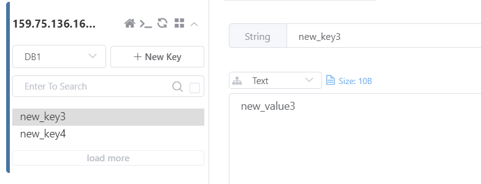

# SpringBoot与缓存

## 整合Redis

关于如何安装Redis，可以查看之前的Redis安装

### 快速开始

#### 导入依赖

```xml
<!--redis-->
<dependency>
    <groupId>org.springframework.boot</groupId>
    <artifactId>spring-boot-starter-data-redis</artifactId>
</dependency>
```

#### 修改`application.yml`

```yaml
spring:
  redis:
    #redis数据库，默认是0
    database: 1
    #redis服务器地址
    host: 127.0.0.1
    #redis服务端口，默认6379
    port: 6379
    #redis密码，默认为空
    password:
```

> `database`选项若不配置默认就是`db0`，如上就是`db1`数据库.

#### 测试

```java
@SpringBootTest
class SpringBootRedisApplicationTests {
	@Autowired
	private RedisTemplate<String, String> redisTemplate;

	@Autowired
	private StringRedisTemplate stringRedisTemplate;

	@Test
	public void contextLoads() {
		redisTemplate.boundValueOps("new_key4").set("new_value4");
		stringRedisTemplate.boundValueOps("new_key3").set("new_value3");
	}
}
```

启动上面测试方法，回到可视化工具查看，出现了两条新的记录：



::: details RedisTemplate与StringRedisTemplate

| name                | tips                                                         |
| ------------------- | ------------------------------------------------------------ |
| RedisTemplate       | 默认采用JDK的序列化策略，key和value都是用这种序列化策略保存的 |
| StringRedisTemplate | 默认采用String的序列化策略，key和value都是用这种序列化策略保存的 |

而翻看源码，发现`StringRedisTemplate`其实是`RedisTemplate`的一个子类：

> 可以看到无论是使用`RedisTemplate`还是`StringRedisTemplate`，新增的数据都没有乱码。
>
> 但是这种方式就必须保证存入的`key`和`value`都是String类型，通过`toString`或`String.valueOf(xx)`转换即可。

:::

### CRUD

经过上面的配置学习，我们可以通过`RedisTemplate`实现一些操作Redis数据库的基本Shell命令。

#### RedisService

封装一个`RedisService.java`接口:

```java
public interface RedisService {

    /**
     * 获取Redis基础info列表
     *
     * @return
     */
    List<RedisInfo> getRedisInfo();

    /**
     * 获取Redis内存占用信息
     *
     * @return
     */
    Map<String, Object> getRedisMemory();

    /**
     * 获取Redis key的数量 --dbsize
     *
     * @return
     */
    Map<String, Object> getRedisDbSize();

    /**
     * 通过pattern正则匹配模糊查询Keys列表
     *
     * @param pattern
     * @return
     */
    Set<String> getKeys(String pattern);

    /**
     * 获取key的value
     *
     * @param arg key
     * @return key-value
     */
    String get(String arg);

    /**
     * 添加key-value
     *
     * @param key   key
     * @param value value
     * @return 是否添加成功
     */
    Boolean set(String key, String value);

    /**
     * 删除key
     *
     * @param keys keys数组
     * @return 成功删除key的个数
     */
    Long del(String... keys);

    /**
     * 判断key是否存在
     *
     * @param keys keys数组
     * @return 存在key的个数
     */
    Long exists(String... keys);

    /**
     * 获取key的剩余过期时间
     *
     * @param key key
     * @return 若key不存在返回-2；若key存在但没有设置过期时间返回-1；否则返回该key的剩余过期时间
     */
    Long pttl(String key);

    /**
     * 以毫秒为单位设置key的生成时间
     *
     * @param key  key
     * @param time 毫秒值
     * @return 设置成功的key个数
     */
    Long pexpire(String key, Long time);
}
```

如上，封装了一些操作Redis常用的命令，看名称就大概能猜到其对应的shell命令是什么（可以通过`redis-cli`工具测试）。

#### RedisServiceImpl

##### getRedisMemory

`spring-data-redis`提供了`RedisTemplate`和`StringRedisTemplate`模板类，因此可以调用`redisTemplate.execute`方法，通过`CallBack`回调机制可以获取到更多redis信息。

```java
@SpringBootTest
class SpringBootRedisApplicationTests {
	@Autowired
	private RedisTemplate<String, String> redisTemplate;

	@Test
	void Test(){
		Object execute = redisTemplate.execute(new RedisCallback() {

			@Override
			public Object doInRedis(RedisConnection redisConnection) throws DataAccessException {
				Map<String, Object> map = new HashMap<>();
				map.put("memory", redisConnection.info("memory").get("used_memory"));
				return map;
			}
		});
		System.out.println(execute);
	}
}
```

但还是不能满足我们的需求，因为，可能要多次调用`RedisCallback`，这里就进行简单的封装：（并且对返回值进行简单的封装）

```java
private RedisConnection execute() {
    return (RedisConnection) redisTemplate.execute(new RedisCallback() {
        @Override
        public Object doInRedis(RedisConnection redisConnection) throws DataAccessException {
            return redisConnection;
        }
    });
}

private Map<String, Object> getData(String name, Object data) {
    Map<String, Object> map = new HashMap<>();
    map.put("create_time", (new Date()).getTime());
    map.put(name, data);
    return map;
}

@Override
public Map<String, Object> getRedisMemory() {
    return getData("memory", execute().info("memory").get("used_memory"));
}
```

> 测试getRedisMemory()方法，可以获取到当前Redis的内存占用信息，如：`memory: 1056696`
