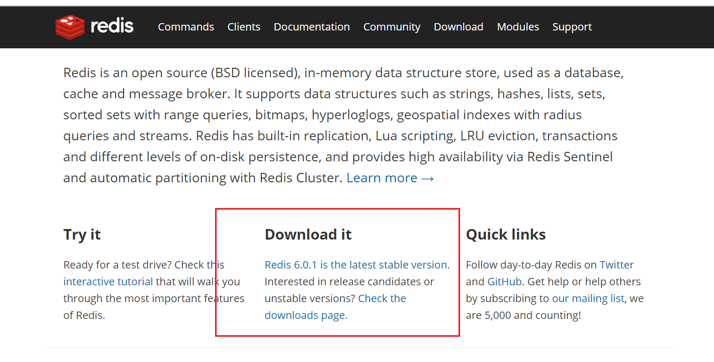
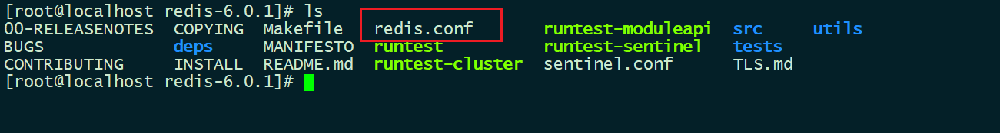
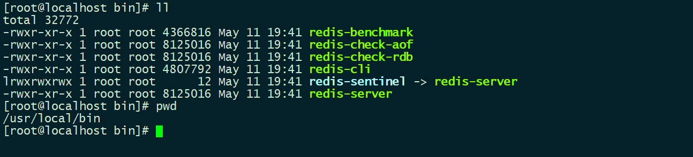
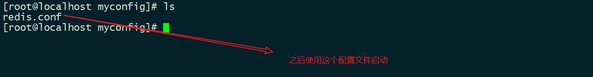
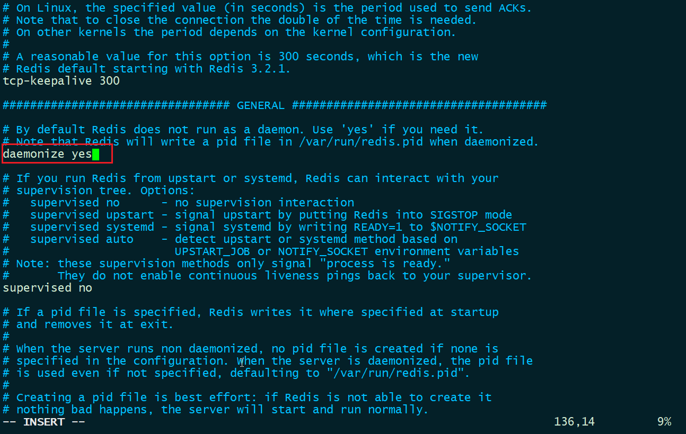
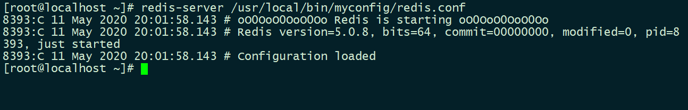
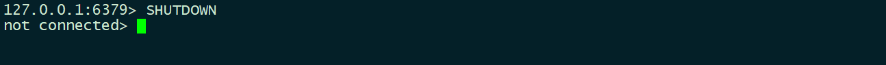

# Redis 安装

## Linux 上安装部署

**1、官网下载 redis**

[redis](https://redis.io/)



```bash
#使用linux wget命令下载
wget http://download.redis.io/releases/redis-5.0.8.tar.gz

#解压源码
tar -zxvf redis-5.0.8.tar.gz

#进入解压后的目录进行编译
cd redis-5.0.8/
```



```bash
#基本的环境安装
yum install -y gcc-c++

#编译安装
make
make install
```

[Linux 下 redis 安装和部署](https://www.jianshu.com/p/bc84b2b71c1c)

redis 默认安装路径`/usr/local/bin`



修改`redis.conf`配置文件

```bash
#/usr/local/bin目录下
mkdir myconfig

cp /opt/redis-5.0.8/redis.conf myconfig/
```



```bash
vim redis.conf
```



启动`redis`服务

```bash
redis-server /usr/local/bin/myconfig/redis.conf
```



客户端连接

```bash
[root@localhost bin]# redis-cli -p 6379
127.0.0.1:6379>
127.0.0.1:6379> set name bzm
OK
127.0.0.1:6379> get naem
(nil)
127.0.0.1:6379> get name
"bzm"
127.0.0.1:6379>

```

退出`redis`



## 测试性能

`redis-benchmark`是-一个压力测试工具！————**官方自带**

[Redis 性能测试](https://www.runoob.com/redis/redis-benchmarks.html)

| 序号 | 选项      | 描述                                       | 默认值    |
| :--- | :-------- | :----------------------------------------- | :-------- |
| 1    | **-h**    | 指定服务器主机名                           | 127.0.0.1 |
| 2    | **-p**    | 指定服务器端口                             | 6379      |
| 3    | **-s**    | 指定服务器 socket                          |           |
| 4    | **-c**    | 指定并发连接数                             | 50        |
| 5    | **-n**    | 指定请求数                                 | 10000     |
| 6    | **-d**    | 以字节的形式指定 SET/GET 值的数据大小      | 2         |
| 7    | **-k**    | 1=keep alive 0=reconnect                   | 1         |
| 8    | **-r**    | SET/GET/INCR 使用随机 key, SADD 使用随机值 |           |
| 9    | **-P**    | 通过管道传输 `<numreq>` 请求               | 1         |
| 10   | **-q**    | 强制退出 redis。仅显示 query/sec 值        |           |
| 11   | **--csv** | 以 CSV 格式输出                            |           |
| 12   | **-l**    | 生成循环，永久执行测试                     |           |
| 13   | **-t**    | 仅运行以逗号分隔的测试命令列表。           |           |
| 14   | **-I**    | Idle 模式。仅打开 N 个 idle 连接并等待。   |           |

简单测试

```bash
# 测试： 100个并发连接100000请求
redis-benchmark -h localhost -p 6379 -c 100 -n 100000
```

## 可视化工具

**[AnotherRedisDesktopManager](https://gitee.com/qishibo/AnotherRedisDesktopManager)**
