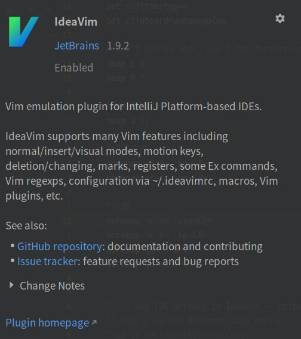
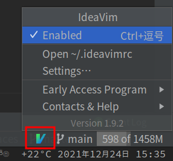
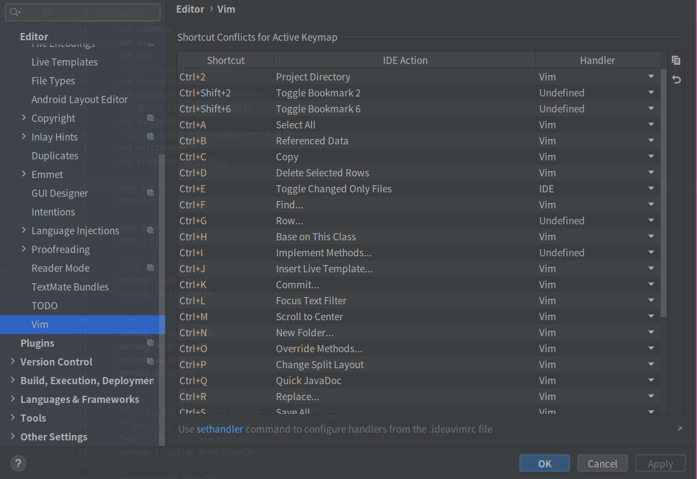

# 高效率编码

## IdeaVim 插件

[github 地址](https://github.com/JetBrains/ideavim)

IdeaVim 是基于 IntelliJ 平台的 IDE 的 Vim 仿真插件。包含了大部分基本功能，普通 / 插入 / 可视模式，动作键，删除 / 更改，标记，寄存器，一些 Ex 命令，Vim regexp，通过〜/.ideavimrc 配置，宏，窗口命令等。详细的可以在[IdeaVim](https://github.com/JetBrains/ideavim)查看。

> 安装的话在 `Settings`| `Plugins` 中搜索安装即可，



重启 IDEA 后，在右下角会有如下的标志，就代表安装成功，点击它即可进行相关配置。该插件默认激活的快捷键好像是`ctrl+shift+v`，个人感觉不太顺手改为了`ctrl+,`。

> 在`Settings`| `keymap`中进行修改即可。



第二栏是`Open ~/.ideavimrc`，即打开 IdeaVim 的配置文件（类似于 vim 的 vimrc 文件）。

```
set scrolloff=5 "保持光标上下行数为5
set nu "行号
set rnu "相对行号

nmap L $ "行首
nmap H ^ "行尾

nmap K 5k "上五行
nmap J 5j "下五行

"切换文件
noremap <c-h> :bp<CR>
noremap <c-l> :bn<CR>

"分屏
noremap <c-n> :vsp<CR>
noremap <c-p> :sp<CR>
noremap qq <c-w>c
noremap qo <c-w>o

"关闭当前buffer
noremap <c-m> :bd!<CR>
```

在 vim 模式中快捷键大概率会有你原本的 Idea 中相互冲突的快捷键，第一次使用使用时候，它会在右下角提示该激活哪个，之后也可以在图标的第三栏的 setting 中进行设置



## acejump

将快速定位到编辑器可见位置

## External Tools

```
$FilePath$ "+norm $LineNumber$G0$ColumnNumber$lh"
```
