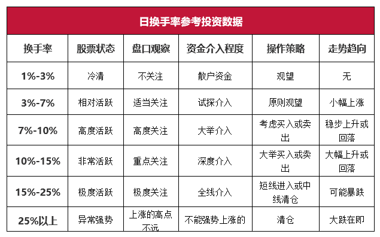
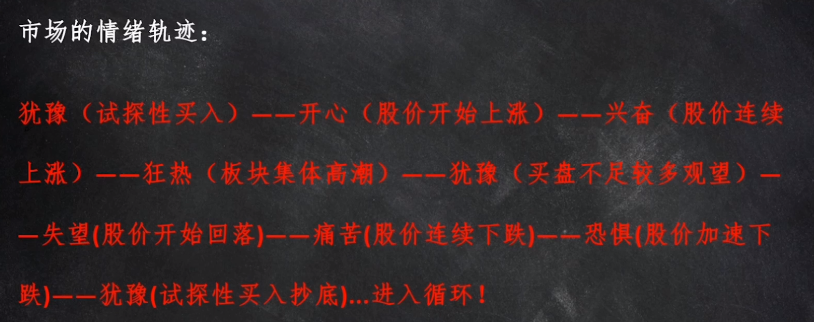
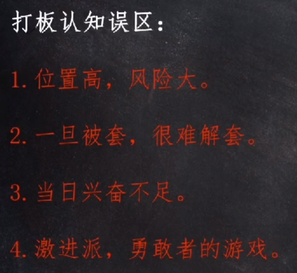

# 炒股

## 软件

## 概念

### 换手率

[集合竞价](https://zhuanlan.zhihu.com/p/137762677)

### MACD

### 筹码

- 获利不抛的筹码是主力的筹码，一般在获利 30% 以下是很难见到主力出货的。
- 解套不卖的筹码是主力的筹码。
- 横盘洗不掉的筹码是主力的筹码。

### 市场情绪

### 看懂股票市盈率 PE

[市盈率](https://zhuanlan.zhihu.com/p/25910900)

## 如何选股

- [影响股价的主要因素有哪些？](https://www.zhihu.com/question/29362860)
- 弱势的股票下跌起来很快，但反弹起来却很慢。这是因为这些股票在每个点位都累积了大量的套牢盘，股价上涨一步就会面临大量套牢盘的抛出，反弹起来会很困难。而强势股由于上方没有过多的套牢盘，反弹或者拉升都会容易很多。
- 不做冷门题材

## 技巧

### 看大盘

### 打板

- 通过集合竞价判断市场情绪（9：20 ～ 9：25）这个涨停板所处的市场人气
- 在确定的一瞬间买人市场上最强的个股龙一、龙二（跟随市场主流）

### 做 T

- [股票 “做 T”](https://zhuanlan.zhihu.com/p/102993677)
- 卖出风险。买入确定

* 每一根 K 线都有存在的意义

1，顺势拿住不要抛
2，热点题材不要抛
3，底部放量不要抛
4，平台突破不要抛
5，相对低位不要抛
6，技术底部不要抛

1, 短期大涨不要碰
2，高位利好不要碰
3，财物造假不要碰
4，下跌趋势不要碰
5，跌破平台不要碰
6，高位换手不要碰
7，股东减持不要碰
8，暴涨暴跌不要碰.

[**我和小明**](https://www.taoguba.com.cn/Article/1628910/1)

### 短线止盈止损

- 第二天不符合预期果断出局
- 损失超 5%果断卖出
- 打妖股，不轻易看空，反复做 t，直到大阴棒出来，跌停

### 尾盘交易
