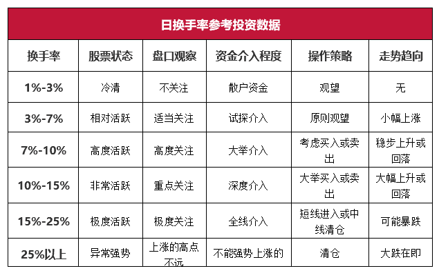

# 炒股

## 概念

### 量比

指的是当天股票开盘之后，平均每分钟的成交量对比前 5 个交易日成交量的比例关系，量比的数值越大，就说明当下，对比前几个交易日的交易活跃程度越高

### 内外盘

内盘就是主动性卖盘，外盘就是主动型买盘。内外盘的数值大小就是多空博弈的力量体现

- 外 > 内，同时量价齐升，高看一线
- 内 > 外，同时放量下跌，果断离场
- 外 > 内，同时股价不涨反跌，如果是在高位，就是在出货了
- 内 > 外，同时股价不跌反而上涨，低位吸筹。内外盘数值都很小，同时股价小幅上涨，说明主力已经锁定筹码，等待时机拉升。

### 换手率

一、低位高换手，这种情况的出现就代表着主力在底部悄悄地吸筹，未来大概率有戏，适合中线低吸，和主力一起建仓埋伏。

二、高位高换手，这就是多家主力在高位出现了多空分歧的表现，有的主力则不断在看多进场，有的则不断地看空出逃，一般这种情况会出现在大龙头和妖股的上涨途中，像这种神仙打架，小散们先离远点，小心别伤着自己，先观察，看哪一方能最终打赢，谁打赢了你跟谁。

三、高位低换手，一般这种情况就是涨不动的表现，上涨无力没有新的资金进场参与，这个时候就要特别注意风险了，谨慎入场。

四、低位低换手，这种多数出现在股价连绵不断的下跌的趋势里，不值得去关注，也不值得去做。

[集合竞价](https://zhuanlan.zhihu.com/p/137762677)

### MACD

均线的认知都是用来判断趋势，均线多头排列为上升趋势，均线空头为下降趋势，短期均线上穿长期均线拐头代表趋势逆转

- MA3加速
- MA5转强
- MA10转变

**股价在均线之上运行，均线起到支撑作用。**

**股价在均线之下运行，均线起到压力作用。**

**在一次对的交易中，盯盘点更倾向于分时与量价的强弱，让利润尽可能的最大化。**

**在一次错的交易中，盯盘点更倾向于均线，把亏损降到最低使盈亏比更加划算。**

1. 买在五日线附近
2. 十日线是短线强势判断的临界点，一旦十日线被有效击穿基本上就不用看了

### 筹码

- 获利不抛的筹码是主力的筹码，一般在获利 30% 以下是很难见到主力出货的。
- 解套不卖的筹码是主力的筹码。
- 横盘洗不掉的筹码是主力的筹码。

### 分时量价

- 第二天开盘做空的量不超过昨天做多的量三分之一，昨天做多的量大概率没有走

### 情绪周期

- 

### 判断市场龙头

- 市场最高连板数量的股票为市场龙头，如果说市场龙断板不超过三天继续涨停，后续补涨起来的连板股没有超过他的涨停数量，那断板再涨停的依旧是市场龙。反过来讲如果龙头断板超过三天，那么以断气论，后面补涨上来的最高高度就是新的市场龙头。

### 看懂股票市盈率 PE

[市盈率](https://zhuanlan.zhihu.com/p/25910900)

### 弱转强

#### 日线级别

强势股并非一路资金打造，而是多路资金共同合力形成。资金的进出就产生成分歧和一致，分歧大了就会跌，一致性强了就会涨。

#### 分时级别

- 底部放量开始拉升
- 点火量最好高于开盘量

## 如何选股

- [影响股价的主要因素有哪些？](https://www.zhihu.com/question/29362860)
- 弱势的股票下跌起来很快，但反弹起来却很慢。这是因为这些股票在每个点位都累积了大量的套牢盘，股价上涨一步就会面临大量套牢盘的抛出，反弹起来会很困难。而强势股由于上方没有过多的套牢盘，反弹或者拉升都会容易很多。
- 不做冷门题材

## 技巧

### 看大盘

### 打板

- 通过集合竞价判断市场情绪（9：20 ～ 9：25）这个涨停板所处的市场人气
- 在确定的一瞬间买人市场上最强的个股龙一、龙二（跟随市场主流）

### 做 T

- [股票 “做 T”](https://zhuanlan.zhihu.com/p/102993677)
- 卖出风险。买入确定

* 每一根 K 线都有存在的意义

[**我和小明**](https://www.taoguba.com.cn/Article/1628910/1)

### 短线止盈止损

- 第二天不符合预期果断出局
- 损失超 5%果断卖出
- 打妖股，不轻易看空，反复做 t，直到大阴棒出来，跌停

### 尾盘交易

### 翘板

- 翘本量要到前一天总成交量20%
- 最好在10：30之前，否则换手不够

### 弱转强

- 前一个分歧日很大，第二天突然被资金一致看好抢筹

### 开盘点位

#### -5%

- 带量上攻，整体版块情绪怎么样
- 开盘下杀，这个股就废了

## 风险释放

风险的释放分两种情况，一种是风险的集中释放，另一种是风险慢慢释放。用白话讲，一个是急跌，一个是阴跌。近期在情绪退潮时很多股票都走出极端走势，有的个股出现连续跌停，而有些则是跌停过后出现涨停反弹，风险集中释放大多可能是机会，风险慢慢释放大多会是风险，我们举近期的例子来解释这个逻辑。

## 复盘

（1）昨日一字板或开盘秒板的。第二天正常预期高开5%以上。
（2）昨日10点前涨停的，第二天正常预期高开4%左右。
（3）昨日11点半前涨停的，第二天正常预期高开3%左右。
（4）昨日午后涨停的，第二天预期平开（-2%-2%）。
（5）昨日烂板（开板5次），第二天预计低开（0至-2%）。
（6）昨日烂板（开板2-4次）10点前涨停的，第二天预计正常预期高开3%左右。

## 错误

- 到计划止盈利线立刻卖出。
- 在没有实现稳定盈利之前，你带来越来，将输得也越多。只有真正实现稳定盈利后你才可以增加自己的投资规模。
- 二三板不及预期立刻抛出
- 历来节前一天市场就喜欢做最高板，节前割肉离场的资金很多又回来了，市场是看涨的

https://www.zhihu.com/people/wu-qian-19-17/answers

**指数与情绪周期的关系：**

1 指数与情绪周期共振上涨，大行情要来临。

2 指数与情绪周期共振下跌，大跌要来临，尽量空仓或者降低仓位减少操作频率。

3 指数跌情绪周期涨，重个股轻大盘。

4 指数涨情绪周期跌，板块轮动快，热点持续性不强，高度空间被压缩。

注意指数先拉（权重白马或金融），还是情绪指标先拉（题材先涨再带动指数上涨）, 就知道是指数行情还是题材行情了。

在周期、情绪、题材三者共振时，去挖局龙头个股确定性最高，也最不容易亏钱。

- 正常情况下，强势股都会走出独立走势无视大盘。但在情绪弱时，强势股受到干扰的概率就会大大增加，看空多了合力就会少。
- 不要想买在最低点，有买点果断出手，之后再考虑卖点

[短线交易之道](https://zhuanlan.zhihu.com/p/363201645)

[短线复盘技巧](https://zhuanlan.zhihu.com/p/268134858)

- 记住，主流恐慌时候越后开板越强。形态强突破平台，昨天虽然烂板但是获利盘被洗完了
- 天量第二天除非个股快速走强锁定头一天的筹码，不然抛压很大走出来会难

地位，主要是板块内部和板块外部的主动性和引导性，需要看上板的时间，上板后同板块是否有小弟跟它，整个板块是否走强。

判断当日情绪

1，连板票开盘是否有溢价；2，主线板块龙头和低位板开盘的强度，有没有强势一字板，有没有开盘核按钮；3，同一个周期下的其他分支线条的龙头和小弟开盘情况。4，老周期的那些龙头和辨识度个股是否止跌。做的熟练以后，基本喵一眼就能判断出来了。
