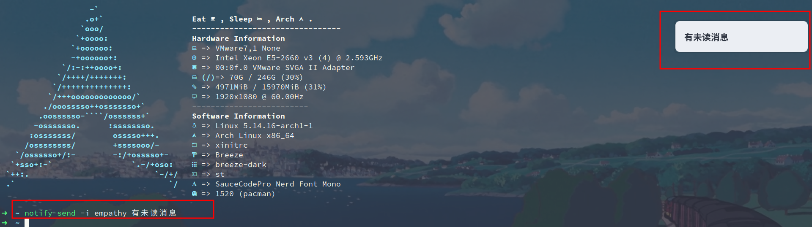

# Arch 常用技巧

### pacman

清理系统中无用的依赖包

```shell
pacman -R $(pacman -Qtdq)
```

> https://gitee.com/yar999/msgq

### 给系统发送通知

```bash
notify-send -i empathy 有未读消息
```



[使用 rdesktop 远程连接 Windows（Failed to connect, CredSSP required by server (check if server has disabled old TLS versions, if yes use -V option) .）](https://blog.csdn.net/qq_37274323/article/details/82086031)
