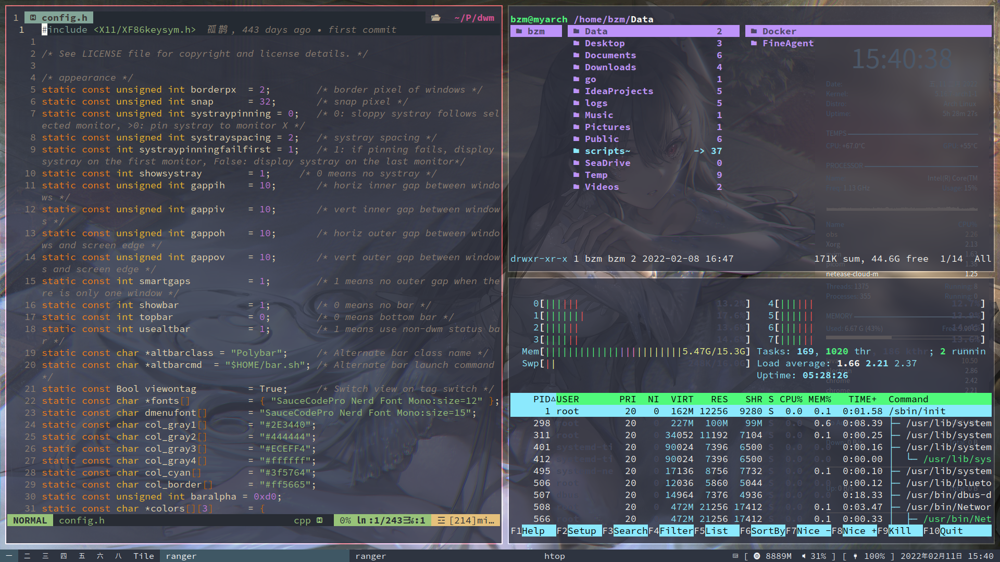
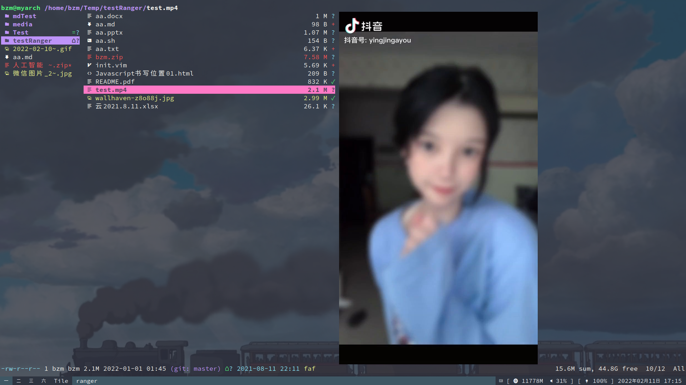

# Arch Linux 介绍

## 写在前面

给大家介绍下我我的日常使用的电脑系统 Arch Linux，先从我的桌面开始说吧。

具体的来说我使用的是窗口管理器（window manager）。在使用 Windwon 时，你的桌面就是：你的桌面，用来供你和计算机交换的界面。但在你使用 Linux 后就会遇到两个概念：窗口管理器和桌面环境。

### 窗口管理器

窗口管理器负责窗口的放置、它们在屏幕上的排列方式(堆叠和平铺),堆叠窗口管理器是大多数人熟悉的，它允许窗口浮动和相互覆盖。 它们允许您在屏幕上自由移动窗口、更改其大小、将其中的两个相邻或重叠放置等。一些流行的平铺窗口管理器是 dwm、i3、awesome、bspwm。

### 桌面环境

桌面环境以窗口管理器为基础,加上工具栏、面板、小工具等等,Linux 中一些最流行的成熟桌面环境是 Gnome、KDE 和 XFCE。

## dwm

[dwm](https://dwm.suckless.org/)是一种的平铺式的动态窗口管理器，它是[suckless](https://suckless.org/)家族的产品，非常的极简，由纯 C 编写并且且它的源码不到 3000 行！！

> suckless 的产品专注于简单、清晰和节俭，这是他们的[软件理念](https://suckless.org/philosophy/)。

下面是我的 dwm 在平铺模式下打开的三个框口

状态栏最左边是标签，当某个标签上有窗口时就会显示，共有九个。

布局模式分别有：平铺，浮动，单片这三种模式。

相关系统信息：内存、音量、电量、时间等

系统托盘：trayer

> dwm 状态栏比较素，为了不影响美感，就配置一个快捷键用来打开或隐藏系统托盘

## st

st 也是[suckless](https://suckless.org/)家族的产品，同样非常的极简，是一个用于终端应用程序的工作图形终端，而且包含了一个终端模拟器它该有的功能：复制粘贴、翻页、透明。

## ranger

ranger 是一个终端下的文件管理器，是使用 Python 编写的。一共用了三列来展示不同的目录层级。主要特点有：vi 风格的快捷键，文件预览，排序，书签，选项卡，选择，命令历史等等。而且有很强的自定义功能（压缩、解压缩、挂载），如键定到外部脚本。

