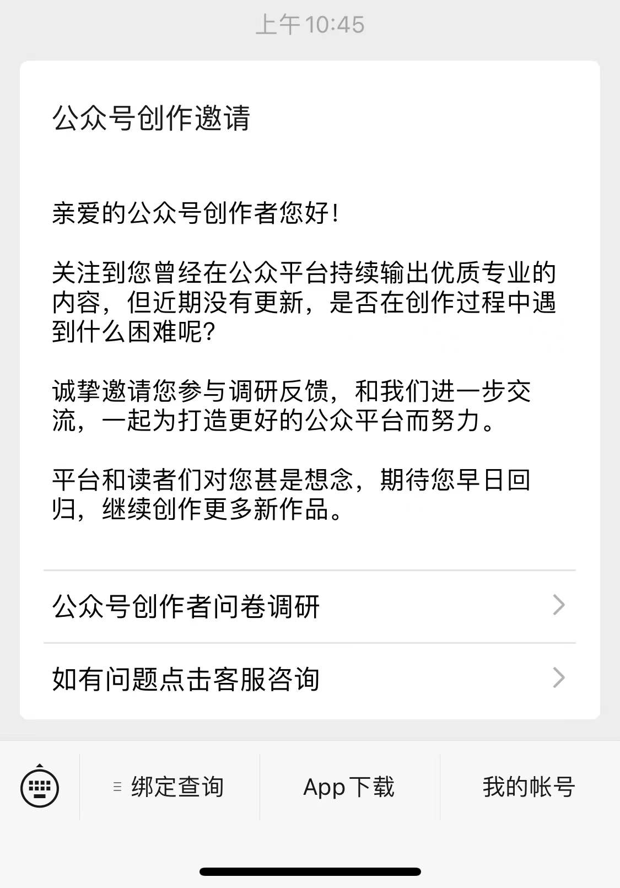
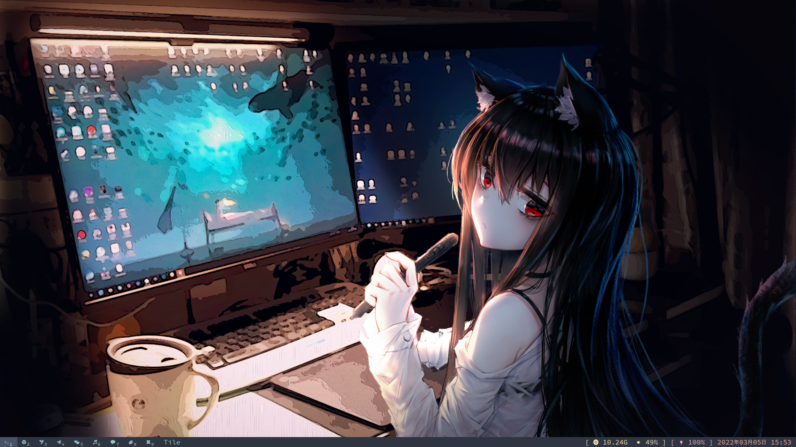
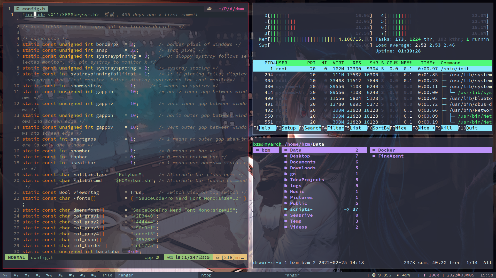
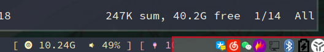
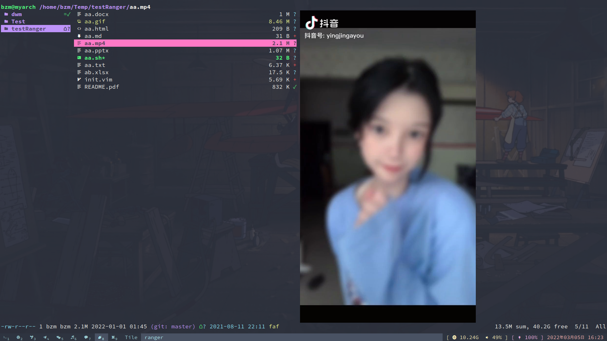

# Arch Linux 介绍

## 1. 写在前面

由于公众号很久没有更新了，然后它居然提醒我了？？？

**想了一下就介绍下我我的日常使用的电脑系统 Arch Linux 吧，我为什么不用 Windows 而使用它呢？**

1. 首要原因是 Windows 太臃肿了，很多功能用不上，开机居然就占用我 3 ～ 4G 的内存（一共就 16G,随便开些日常应用微信、浏览器等等内存直接过半了）。这些就算了，进行基本操作时还时不时卡一下！！！
2. Arch Linux 非常的精简，高度定制化。安装完只有一个黑黑的终端界面。所有的一切呢需要你去自己构建一个“完全属于自己的电脑”，这就非常符合我的需求。

**先来从下面图看一下我的电脑界面吧，非常的简单，不注意下方的话可能还以为是一张壁纸～**

从桌面开始说吧，严格的来说是叫窗口管理器（window manager）当你在使用 Windwon 时候，你可能听说过“桌面环境”，这时，你的桌面就是：你的桌面，也就是桌面环境，用来供你和计算机交换的界面。

但在你使用 Linux 后就会遇到一个单独概念：窗口管理器。总之他们就是来管理你的窗口。

### 1.1. 窗口管理器

窗口管理器从字面上说管理窗口的放置、它们在屏幕上的排列方式(堆叠和平铺),堆叠窗口管理器是大多数人熟悉的，它允许窗口浮动和相互覆盖。 它们允许您在屏幕上自由移动窗口、更改其大小、将其中的两个相邻或重叠放置等。一些流行的平铺窗口管理器是 dwm、i3、awesome、bspwm。好处就是时刻最大化的改变你每个窗口的大小。

### 1.2. 桌面环境

桌面环境以窗口管理器为基础,加上工具栏、面板、小工具等等,Linux 中一些最流行的成熟桌面环境是 Gnome、KDE 和 XFCE。

## 2. dwm

**我使用的是 dwm (dynamic window manager)，动态窗口管理器。**

[dwm](https://dwm.suckless.org/)是一种的平铺式的动态窗口管理器，它是[suckless](https://suckless.org/)家族的产品，非常的极简，由纯 C 编写并且且它的源码不到 3000 行！！

> suckless 的产品专注于简单、清晰和节俭，这是他们的[软件理念](https://suckless.org/philosophy/)。

下面是我的 dwm 在平铺模式下打开的三个框口

状态栏分为三部分：

- 最左边是标签，当某个标签上有窗口时就会显示，共有九个。
- 布局模式分别有：平铺，浮动，单片这三种模式。
- 相关系统信息：内存、音量、电量、时间等

> **系统托盘：traye**
>
> dwm 状态栏比较素，为了不影响美感，就配置一个快捷键用来打开或隐藏系统托盘

## 3. st

st 是终端模拟器，也是[suckless](https://suckless.org/)家族的产品，同样非常的极简，而且包含了一个终端模拟器它该有的功能：复制粘贴、翻页、透明。

## 4. ranger

ranger 是一个终端下的文件管理器，是使用 Python 编写的。一共用了三列来展示不同的目录层级。主要特点有：vi 风格的快捷键，文件预览，排序 ，书签，选项卡，选择，命令历史等等。而且有很强的自定义功能（压缩、解压缩、挂载），如键定到外部脚本。

