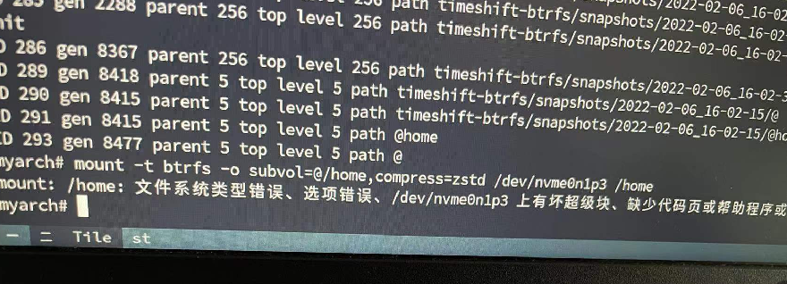
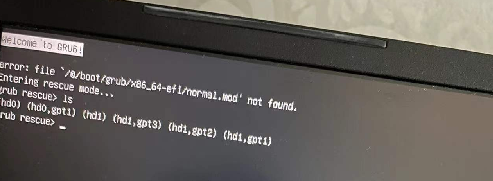

# Arch 系统恢复

## 问题

首先我使用的是 Arch Linux 系统～前些天因为进行一些危险操作，不小心导致挂载的/home 出现了坏快

经过一系列操作后，很好～系统也进不去了

## 解决

### 备份原系统

使用 U 盘通过系统启动盘进入，使用 [Rsync 工具备份全系统](https://wiki.archlinux.org/title/Rsync_(%E7%AE%80%E4%BD%93%E4%B8%AD%E6%96%87)#%E5%85%A8%E7%9B%98%E7%B3%BB%E7%BB%9F%E5%A4%87%E4%BB%BD)

## 参考资料

- [Arch Linux 系统迁移到全新的 SSD 固态硬盘](https://poemdear.com/2019/10/31/arch-linux-%E7%B3%BB%E7%BB%9F%E8%BF%81%E7%A7%BB%E5%88%B0%E5%85%A8%E6%96%B0%E7%9A%84ssd%E5%9B%BA%E6%80%81%E7%A1%AC%E7%9B%98/)
