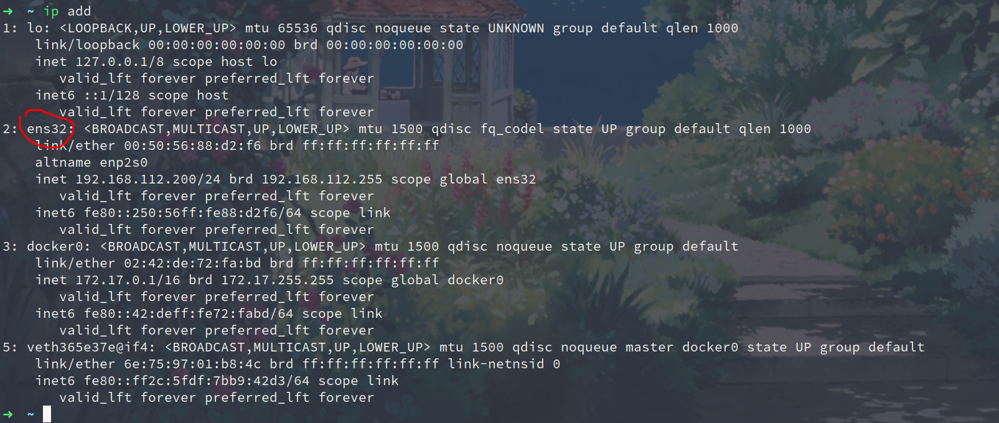

# Arch配置

### 安装openssh服务

```shell
pacman -S openssh //安装openssh服务
systemctl start sshd.service //启动openssh服务
systemctl enable sshd.service //设置开机启动ssh服务
vim /etc/ssh/sshd_config //编辑sshd配置文件
  # Authentication:   //运行root用户进行ssh登入
  LoginGraceTime 2m  //将注释#号去掉
  #PermitRootLogin prohibit-password
  PermitRootLogin yes   //添加一行
  StrictModes yes      //将注释#号去掉
```

### 配置静态ip

```shell
sudo systemctl status systemd-networkd
ip add //  或者 ifconfig
```

如图可见我的网卡名称是：`ens32` ，所以我们在在 `/etc/systemd/network` 目录下添加配置文件 `10-static-enp1s0.network` 



```shell
vim /etc/systemd/network/10-static-ens32.network
```

```shell
[Match]
Name=ens32

[Network]
Address=192.168.112.200/24
Gateway=192.168.112.254
DNS=8.8.8.8 114.114.114.114
```

```shell
sudo systemctl reenable systemd-networkd
```

> 重启

### 创建用户 

```shell
useradd -m -G wheel bzm
passwd
vim /etc/sudoers

#%wheel ALL=(ALL) ALL //将注释#去掉，让这个组中用户可以执行任何命令。保存退出

su - bzm
```

### archlinuxcn源

```shell
sudo vim /etc/pacman.conf

# 腾讯云 (Global CDN) (ipv4, http, https)
Server = https://mirrors.cloud.tencent.com/archlinuxcn/$arch

#更新软件包缓存：
sudo pacman -Syy
sudo pacman -S archlinuxcn-keyring

sudo pacman -S yay
yay --aururl "https://aur.tuna.tsinghua.edu.cn" --save

sudo pacman -Syu
```


```sh
sudo pacman -S git wget curl base-devel xorg networkmanager netctl pcsclite nerd-fonts

# 时间同步
sudo timedatectl set-ntp true

sudo git clone https://gitee.com/BuZM/config ~/.config
```

### zsh

```shell
sudo pacman -S zsh
chsh -s $(which zsh)
sudo git clone https://gitee.com/BuZM/oh-my-zsh ~/.oh-my-zsh
ln .config/zsh/zshrc .zshrc

# zsh plugs
cd ~/.oh-my-zsh/plugins

# 历史记录
git clone git://github.com/zsh-users/zsh-autosuggestions.git
# 语法检查
git clone https://github.com/zsh-users/zsh-syntax-highlighting.git
```

### neovim

```shell
sudo pacman -S neovim python-pip nodejs npm xclip
sudo pip config set global.index-url https://pypi.tuna.tsinghua.edu.cn/simple
sudo pip3 install --user neovim
python3 -m pip install --user --upgrade pynvim
sudo npm config set registry https://registry.npm.taobao.org
sudo npm config get registry
sudo npm install -g neovim
```

> PlugInstall

```shell
"Plug 'junegunn/vim-peekaboo'
```


### FZF

```shell
cd ~
git clone --depth 1 https://github.com/junegunn/fzf.git ~/.fzf
~/.fzf/install
ln ~/.fzf/bin/fzf /usr/local/bin/

# ag
sudo pacman -S the_silver_searcher
```

### Ranger

```shell
cd ~
sudo pacman -S ranger w3m highlight ueberzug nerd-fonts atool p7zip

vim ~/.config/ranger/rc.conf  
default_linemode devicons2
```


### 常用软件

```shell
# 输入法
yaourt -S fcitx fcitx-im fcitx-sogoupinyin kcm-fcitx fcitx-configtool

# 浏览器
sudo pacman -S chromium

# markdown编辑器
sudo pacman -S typora

# 网易云音乐
sudo pacman -S netease-cloud-music 

sudo pacman -S xmind-zen

yay -S wps-office-cn wps-office-mui-zh-cn ttf-wps-fonts python-xlsx2csv

sudo pacman -S flameshot dunst 
```


### 鼠标速度

[修改Linux系统的鼠标滚轮的速度](https://zhuanlan.zhihu.com/p/126336905)

https://blog.csdn.net/qq_32767041/article/details/84034280

```
sudo pacman -S imwheel
vim ~/.imwheelrc

".*"
None,      Up,   Button4, 3
None,      Down, Button5, 3
Control_L, Up,   Control_L|Button4
Control_L, Down, Control_L|Button5
Shift_L,   Up,   Shift_L|Button4
Shift_L,   Down, Shift_L|Button5
```


Arch 虚拟机下KDE 分辨率问题（闪一下又还原）

```shell
pacman -S open-vm-tools gtkmm gtkmm3 gtk2 xf86-input-vmouse xf86-video-vmware mesa
systemctl start vmware-vmblock-fuse.service
systemctl enable vmware-vmblock-fuse.service
systemctl enable vmtoolsd.service
nano /etc/mkinitcpio.conf #修改MODULES=( )为
MODULES=(vsock vmw_vsock_vmci_transport vmw_balloon vmw_vmci vmwgfx)
mkinitcpio -p linux或 mkinitcpio -P
```
