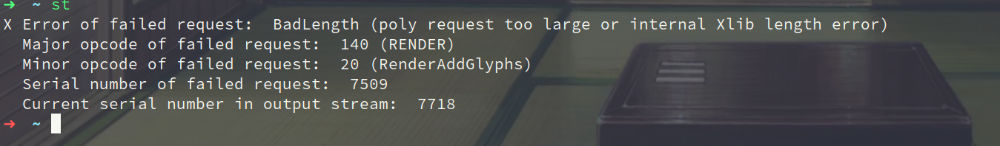

# Arch 问题解决

## emoji 导致 X 崩溃

### 原因

X Error of failed request: BadLength (poly request too large or internal Xlib length error)



### 解决

[参考资料](https://unix.stackexchange.com/questions/629281/gitk-crashes-when-viewing-commit-containing-emoji-x-error-of-failed-request-ba)

```bash
yay -S libxft-bgra
```

## flameshot 截图后卡顿

### 原因

flameshot 截图后会发送一个系统通知

### 解决

```shell
sudo pacman -S dunst
```

## [ArchLinux 安装完没有声音之解决办法](https://segmentfault.com/a/1190000002918394)


## [系统在休眠后没有断电](https://wiki.archlinux.org/title/Power_management_(%E7%AE%80%E4%BD%93%E4%B8%AD%E6%96%87)/Suspend_and_hibernate_(%E7%AE%80%E4%BD%93%E4%B8%AD%E6%96%87)#%E7%B3%BB%E7%BB%9F%E5%9C%A8%E4%BC%91%E7%9C%A0%E5%90%8E%E6%B2%A1%E6%9C%89%E6%96%AD%E7%94%B5)
