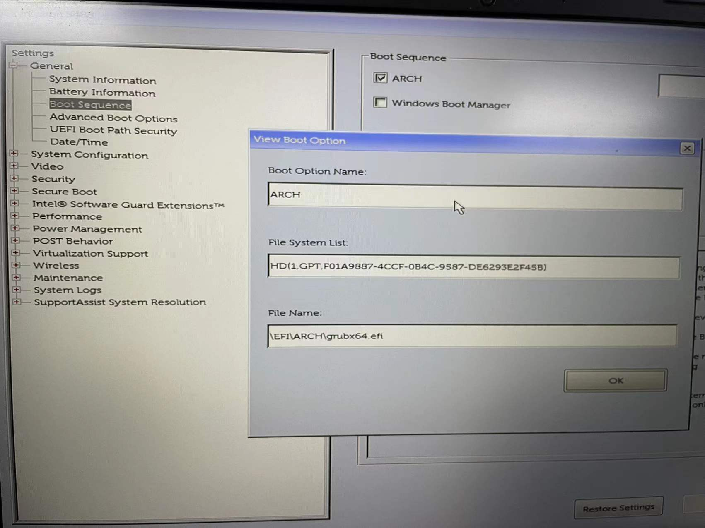
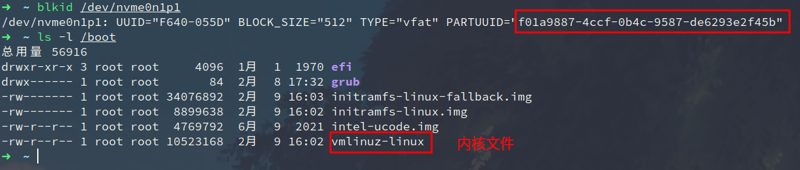

# Linux系统启动过程

## 整体流程

**Linux系统启动流程大概可以分为以下几步：**

1. POST（加电自检）
2. 加载 BIOS（Basic  Input/Outpu System)，确定启动设备（Boot sequence)、运行 Boot  Loader
3. 加载内核（kernel）初始化 initrd
4.  运行 /sbin/init 初始化系统
5. 建立虚拟终端 ，用户登录系统

## POST 开机自检

机器开机加电后，首先会开始进行自检，该过程主要对计算机各种硬件设备进行检测，如 CPU、内存、主板、硬盘、CMOS芯片等。若出现故障则会发出声音等提示信号，反之加电自检完成。

## 加载 BIOS、确定Boot sequence、运行 Boot  Loader

自检完成后按照 BIOS 中设定的启动次序（Boot Sequence) 逐一查找可启动设备，找到启动设备后，运行Boot  Loader，读入 /boot 目录下的内核文件加载到内存去执行。

> Boot Loader 常用的有 GRUB 和 LILO 两种，现在常用的是 GRUB。

以我的Boot Sequence设置为例，它会找`f01a9887-4ccf-0b4c-9587-de6293e2f45b`分区下的内核文件

## 参考资料

- [史上最详细 linux 启动过程讲解](https://cloud.tencent.com/developer/article/1114481)