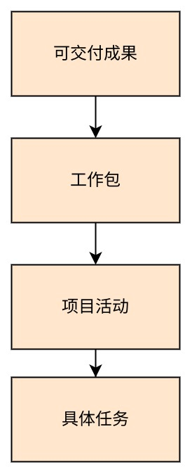
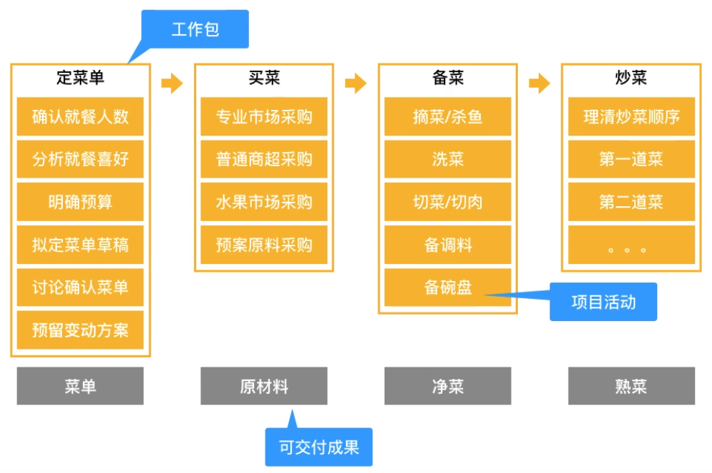

# 项目管理 WBS

## 工作分解结构（Work Breakdown Structure）

工作分解结构（Work Breakdown Structure, WBS）：以可交付成果为导向对项目要素进行的分组，它归纳和定义了项目的整个工作范围每下降一层代表对项目工作的更详细定义。——[百度百科](https://baike.baidu.com/item/%E5%B7%A5%E4%BD%9C%E5%88%86%E8%A7%A3%E7%BB%93%E6%9E%84/8668423?fromtitle=WBS&fromid=9518746&fr=aladdin)

> 简单的就只包括：可交付的成果、工作包。

## 做一顿饭的 WBS

基本流程就是：定菜单->买菜->备菜->炒菜，那么它们的可交付成果就是菜单、原材料、净菜、熟菜。

由各种小的可交付成果，最终组成**年夜饭**这个大的可交付成果。

## 可交付的成果

1. 可交付成果：可见的、可验证的产品或服务。反例：领导让谁谁谁把这个事做一下～（这个事情做到什么程度，你期待得到什么样的成果；同样在向领导反馈时候给出一个可见的成果）
2. 围绕可交付的成果，确定任务的构成
3. 项目范围、产品范围（刚才年夜饭的 WBS 就是一个项目范围的形式展开）

## 参考资料

- [项目管理中的 WBS](https://www.bilibili.com/video/BV14e411x7W1?spm_id_from=333.1007.top_right_bar_window_history.content.click)
